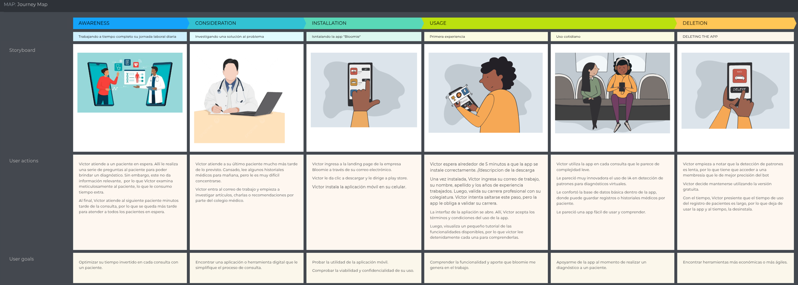
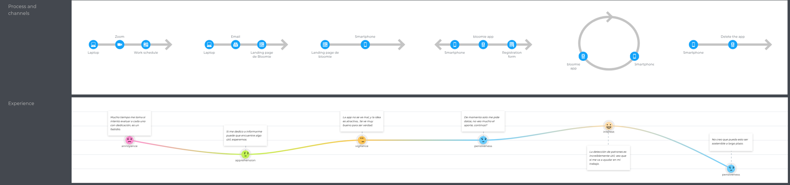
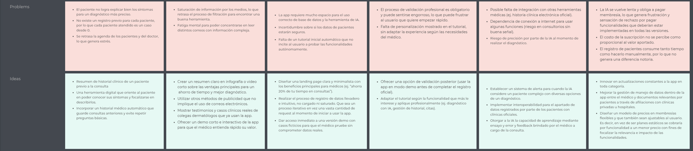

# Universidad Peruana de Ciencias Aplicadas

## Facultad de Ingeniería

## Programa Académico de Ingeniería de Software

**Ciclo:** 2026-10

**Curso:** Desarrollo de aplicaciones Open Source

**NRC:** 11881

**Docente del curso:** Efraín Ricardo Bautista Ubillús

# Informe de Trabajo Final

**Nombre de la Startup:** Dermacare

**Nombre del producto:** Bloomie

## Integrantes

u202416272 - Asmat Alminco, Martin Alejandro 
u202414802 - Contreras Torres, Arturo Valentino 
u202414970 - Gallardo Morales, Carla Alejandra 
u20241b843 - Mechan Montenegro, Luciana Carolina 
u202415551 - Ramirez Ruiz, Nickolas

*Abril, 2026*

---

# Registro de Versiones del Informe

| Versión | Fecha | Autor | Descripción de modificación |
|---------|-------|-------|-----------------------------|
| | | | |

---

# Project Report Collaboration Insights

---

# Contenido

## Tabla de Contenidos

- [Universidad Peruana de Ciencias Aplicadas](#universidad-peruana-de-ciencias-aplicadas)
  - [Facultad de Ingeniería](#facultad-de-ingeniería)
  - [Programa Académico de Ingeniería de Software](#programa-académico-de-ingeniería-de-software)
- [Informe de Trabajo Final](#informe-de-trabajo-final)
  - [Integrantes](#integrantes)
- [Registro de Versiones del Informe](#registro-de-versiones-del-informe)
- [Project Report Collaboration Insights](#project-report-collaboration-insights)
- [Contenido](#contenido)
  - [Tabla de Contenidos](#tabla-de-contenidos)
- [Student Outcome](#student-outcome)
- [Capítulo I: Introducción](#capítulo-i-introducción)
  - [1.1. Startup Profile](#11-startup-profile)
    - [1.1.1. Descripción de la Startup](#111-descripción-de-la-startup)
    - [Misión](#misión)
    - [Visión](#visión)
    - [Valores](#valores)
    - [1.1.2. Perfiles de integrantes del equipo](#112-perfiles-de-integrantes-del-equipo)
    - [Perfil del Integrante](#perfil-del-integrante)
  - [1.2. Solution Profile](#12-solution-profile)
    - [Descripción de la Solución](#descripción-de-la-solución)
    - [1.2.1. Antecedentes y problemática](#121-antecedentes-y-problemática)
        - [Metodología 5W+2H](#metodología-5w2h)
          - [What (Qué)](#what-qué)
          - [When (Cuándo)](#when-cuándo)
          - [Where (Dónde)](#where-dónde)
          - [Who (Quién)](#who-quién)
          - [Why (Por qué)](#why-por-qué)
          - [How (Cómo)](#how-cómo)
        - [How much (Cuánto)](#how-much-cuánto)
    - [1.2.2. Lean UX Process](#122-lean-ux-process)
      - [1.2.2.1. Lean UX Problem Statements](#1221-lean-ux-problem-statements)
      - [1.2.2.2. Lean UX Assumptions](#1222-lean-ux-assumptions)
      - [1.2.2.3. Lean UX Hypothesis Statements](#1223-lean-ux-hypothesis-statements)
      - [1.2.2.4. Lean UX Canvas](#1224-lean-ux-canvas)
  - [1.3. Segmentos objetivo](#13-segmentos-objetivo)
      - [Segmento 1: Jóvenes adultos de 21 a 30 años interesados en el cuidado de la piel](#segmento-1-jóvenes-adultos-de-21-a-30-años-interesados-en-el-cuidado-de-la-piel)
      - [Segmento 2: Dermatólogos certificados](#segmento-2-dermatólogos-certificados)
- [Capítulo II: Requirements Elicitation \& Analysis](#capítulo-ii-requirements-elicitation--analysis)
  - [2.1. Competidores](#21-competidores)
      - [Skin Bliss](#skin-bliss)
      - [Miiskin Skin Tracker](#miiskin-skin-tracker)
      - [First Derm](#first-derm)
    - [2.1.1. Análisis competitivo](#211-análisis-competitivo)
  - [Competitive Analysis Landscape](#competitive-analysis-landscape)
    - [2.1.2. Estrategias y tácticas frente a competidores](#212-estrategias-y-tácticas-frente-a-competidores)
  - [2.2. Entrevistas](#22-entrevistas)
    - [2.2.1. Diseño de entrevistas](#221-diseño-de-entrevistas)
      - [Segmento 1: Jóvenes adultos interesados en skincare](#segmento-1-jóvenes-adultos-interesados-en-skincare)
      - [Segmento 2: Dermatólogos certificados](#segmento-2-dermatólogos-certificados-1)
    - [2.2.2. Registro de entrevistas](#222-registro-de-entrevistas)
    - [2.2.3. Análisis de entrevistas](#223-análisis-de-entrevistas)
  - [2.3. Needfinding](#23-needfinding)
    - [2.3.1. User Personas](#231-user-personas)
    - [2.3.2. User Task Matrix](#232-user-task-matrix)
    - [2.3.3. User Journey Mapping](#233-user-journey-mapping)
    - [2.3.4. Empathy Mapping](#234-empathy-mapping)
  - [2.4. Big Picture Event Storming](#24-big-picture-event-storming)
  - [2.5. Ubiquitous Language](#25-ubiquitous-language)
- [Capítulo III: Requirements Specification](#capítulo-iii-requirements-specification)
  - [3.1. User Stories](#31-user-stories)
  - [3.2. Impact Mapping](#32-impact-mapping)
  - [3.3. Product Backlog](#33-product-backlog)
- [Capítulo IV: Product Design](#capítulo-iv-product-design)
  - [4.1. Style Guidelines](#41-style-guidelines)
    - [4.1.1. General Style Guidelines](#411-general-style-guidelines)
    - [4.1.2. Web Style Guidelines](#412-web-style-guidelines)
  - [4.2. Information Architecture](#42-information-architecture)
    - [4.2.1. Organization Systems](#421-organization-systems)
    - [4.2.2. Labeling Systems](#422-labeling-systems)
    - [4.2.3. SEO Tags and Meta Tags](#423-seo-tags-and-meta-tags)
    - [4.2.4. Searching Systems](#424-searching-systems)
    - [4.2.5. Navigation Systems](#425-navigation-systems)
  - [4.3. Landing Page UI Design](#43-landing-page-ui-design)
    - [4.3.1. Landing Page Wireframe](#431-landing-page-wireframe)
    - [4.3.2. Landing Page Mock-up](#432-landing-page-mock-up)
  - [4.4. Web Applications UX/UI Design](#44-web-applications-uxui-design)
    - [4.4.1. Web Applications Wireframes](#441-web-applications-wireframes)
    - [4.4.2. Web Applications Wireflow Diagrams](#442-web-applications-wireflow-diagrams)
    - [4.4.3. Web Applications Mock-ups](#443-web-applications-mock-ups)
    - [4.4.4. Web Applications User Flow Diagrams](#444-web-applications-user-flow-diagrams)
  - [4.5. Web Applications Prototyping](#45-web-applications-prototyping)
  - [4.6. Domain-Driven Software Architecture](#46-domain-driven-software-architecture)
    - [4.6.1. Design-Level Event Storming](#461-design-level-event-storming)
    - [4.6.2. Software Architecture Context Diagram](#462-software-architecture-context-diagram)
    - [4.6.3. Software Architecture Container Diagrams](#463-software-architecture-container-diagrams)
    - [4.6.4. Software Architecture Components Diagrams](#464-software-architecture-components-diagrams)
  - [4.7. Software Object-Oriented Design](#47-software-object-oriented-design)
    - [4.7.1. Class Diagrams](#471-class-diagrams)
  - [4.8. Database Design](#48-database-design)
    - [4.8.1. Database Diagrams](#481-database-diagrams)
- [Capítulo V: Product Implementation, Validation \& Deployment](#capítulo-v-product-implementation-validation--deployment)
  - [5.1. Software Configuration Management](#51-software-configuration-management)
    - [5.1.1. Software Development Environment Configuration](#511-software-development-environment-configuration)
    - [5.1.2. Source Code Management](#512-source-code-management)
    - [5.1.3. Source Code Style Guide \& Conventions](#513-source-code-style-guide--conventions)
    - [5.1.4. Software Deployment Configuration](#514-software-deployment-configuration)
  - [5.2. Landing Page, Services \& Applications Implementation](#52-landing-page-services--applications-implementation)
    - [5.2.1. Sprint 1](#521-sprint-1)
      - [5.2.1.1. Sprint Planning 1](#5211-sprint-planning-1)
      - [5.2.1.2. Aspect Leaders and Collaborators](#5212-aspect-leaders-and-collaborators)
      - [5.2.1.3. Sprint Backlog 1](#5213-sprint-backlog-1)
      - [5.2.1.4. Development Evidence for Sprint Review](#5214-development-evidence-for-sprint-review)
      - [5.2.1.5. Execution Evidence for Sprint Review](#5215-execution-evidence-for-sprint-review)
      - [5.2.1.6. Services Documentation Evidence for Sprint Review](#5216-services-documentation-evidence-for-sprint-review)
      - [5.2.1.7. Software Deployment Evidence for Sprint Review](#5217-software-deployment-evidence-for-sprint-review)
      - [5.2.1.8. Team Collaboration Insights during Sprint](#5218-team-collaboration-insights-during-sprint)
- [Conclusiones](#conclusiones)
  - [Conclusiones y recomendaciones](#conclusiones-y-recomendaciones)
  - [Video About-the-Team](#video-about-the-team)
- [Bibliografía](#bibliografía)
- [Anexos](#anexos)

---

# Student Outcome

El curso contribuye al cumplimiento del Student Outcome ABET:

**ABET – EAC - Student Outcome 3**

**Criterio:** *Capacidad de comunicarse efectivamente con un rango de audiencias.*

En el siguiente cuadro se describe las acciones realizadas y enunciados de conclusiones por parte del grupo, que permiten sustentar el haber alcanzado el logro del ABET – EAC - Student Outcome 3.

| Criterio específico | Acciones realizadas | Conclusiones |
|---------------------|---------------------|--------------|
| **Comunica oralmente con efectividad a diferentes rangos de audiencia.** | Asmat Alminco, Martin Alejandro  **AV1**     Contreras Torres, Arturo Valentino  **AV1**     Gallardo Morales, Carla Alejandra  **AV1**     Mechan Montenegro, Luciana Carolina  **AV1**     Ramirez Ruiz, Nickolas  **AV1**   | |
| **Comunica por escrito con efectividad a diferentes rangos de audiencia.** | Asmat Alminco, Martin Alejandro  **AV1**     Contreras Torres, Arturo Valentino  **AV1**     Gallardo Morales, Carla Alejandra  **AV1**     Mechan Montenegro, Luciana Carolina  **AV1**     Ramirez Ruiz, Nickolas  **AV1**   | |

---

# Capítulo I: Introducción

## 1.1. Startup Profile

### 1.1.1. Descripción de la Startup

Hoy en día, el cuidado personal ha tomado gran relevancia, lo que ha convertido al mercado del skincare en uno de los más dinámicos y en constante crecimiento. Cada vez más personas, tanto jóvenes como adultos, buscan alternativas que les permitan mantener una piel saludable y cuidar su apariencia. Sin embargo, este creciente interés ha traído consigo la necesidad de soluciones innovadoras que conecten las expectativas de los usuarios con herramientas confiables, accesibles y basadas en información objetiva.

Es en este escenario que nace Dermacare, una startup comprometida en ayudar a las personas a comprender y gestionar su rutina de cuidado de la piel de manera informada y personalizada. Como parte de esta propuesta surge Bloomie, una aplicación web y móvil que integra servicios de Inteligencia Artificial para analizar el estado de la piel a partir de imágenes y generar recomendaciones personalizadas.

Bloomie se posiciona como el núcleo de la solución, brindando una experiencia digital intuitiva que acompaña al usuario en la toma de decisiones relacionadas con su cuidado personal. A través de la combinación de análisis automatizado, seguimiento de la evolución de la piel y acceso a servicios dermatológicos, la plataforma busca convertirse en un aliado confiable en el día a día del usuario.

---

### Misión

Brindamos una guía integral y personalizada para el cuidado de la piel mediante el uso de servicios de inteligencia artificial y análisis de datos dermatológicos. Ofrecemos rutinas adaptadas a cada tipo de piel, recomendaciones de productos ajustadas al presupuesto y objetivos del usuario, así como herramientas digitales accesibles que promueven hábitos de skincare saludables y sostenibles.

---

### Visión

Convertirnos en la plataforma líder de cuidado de la piel a nivel global, reconocida por integrar análisis inteligente y validación profesional como base para generar rutinas personalizadas y efectivas. Nuestro propósito es impactar positivamente en millones de personas, ayudándoles a prevenir y tratar problemas dermatológicos, al mismo tiempo que fortalecemos su confianza y bienestar.

---

### Valores

- **Accesibilidad:**  
  En Dermacare creemos que el cuidado de la piel debe estar al alcance de todos. Nuestra plataforma está diseñada para ser intuitiva y fácil de usar, adaptándose a distintos niveles de conocimiento y presupuestos.

- **Innovación:**  
  Integramos servicios de inteligencia artificial para transformar la experiencia del skincare, ofreciendo recomendaciones basadas en datos y en constante mejora. Apostamos por la tecnología como motor de soluciones modernas y efectivas.

- **Confianza:**  
  La salud de la piel requiere respaldo y seguridad. Por ello, combinamos análisis automatizados con la posibilidad de acceso a profesionales dermatológicos, fortaleciendo la credibilidad de la plataforma.

- **Bienestar:**  
  Más allá de la estética, buscamos mejorar la calidad de vida de nuestros usuarios. Promovemos hábitos de cuidado que fortalecen la salud de la piel y contribuyen a su bienestar integral.

### 1.1.2. Perfiles de integrantes del equipo

### Perfil del Integrante

<table>
  <tr>
    <td rowspan="4" align="center">
      
    </td>
    <td><b>Nombre:</b> Carla Alejandra Gallardo Morales</td>
  </tr>
  <tr>
    <td><b>Código:</b> u202414970 </td>
  </tr>
  <tr>
    <td>
      <b>Descripción:</b> 
      Soy <b>Carla Alejandra Gallardo Morales</b>, tengo 19 años. Desde que me incorporé en la Universidad Peruana de Ciencias Aplicadas en el periodo 2024-01, es decir que ahora mismo estoy cursando el quinto ciclo de la carrera de Ing. de Software, he adquirido y desarrollado distintos conocimientos a cerca de la programación, específicamente en el lenguaje C++ y Java, además, de forma autodidacta y extracurricular, he profundizado en el lenguaje Python, lo que ha ampliado mi perspectiva sobre la lógica y resolución de problemas.
        
        Dentro del equipo, mi contribución se basa en el apoyo continuo del desarrollo del backend y frontend de nuestro aplicativo, asimismo ayudo en la implementación del informe de nuestro proyecto.
    </td>
  </tr>
</table>

<table>
  <tr>
    <td rowspan="4" align="center">
      
    </td>
    <td><b>Nombre:</b> Arturo Valentino Contreras Torres</td>
  </tr>
  <tr>
    <td><b>Código:</b> u202414802</td>
  </tr>
  <tr>
    <td>
      <b>Descripción:</b> 
      Soy <b>Arturo Valentino Contreras Torres</b>, tengo 19 años y estudio la carrera de Ingeniería de Software en la UPC, actualmente estoy en el 5to ciclo. Me gusta aprender y aplicar tecnologías innovadoras para resolver problemas complejos y desarrollar soluciones eficientes. Me apasiona participar en concursos de programación en donde aprendo más sobre temas como programación competitiva, lenguajes como C++, Python, Java, frameworks como Flutter y habilidades como el trabajo en equipo.
        
      Dentro del equipo, contribuyo en el desarrollo frontend y backend, asegurándome de aplicar principios de Domain Driven Design, patrones de diseño y buenas prácticas de desarrollo de software. Me considero una persona responsable, creativa y orientada al trabajo en equipo, con un enfoque en la mejora continua frente a nuevos desafíos.
    </td>
  </tr>
</table>

<table>
  <tr>
    <td rowspan="4" align="center">
      
    </td>
    <td><b>Nombre:</b> Luciana Carolina Mechan Montenegro</td>
  </tr>
  <tr>
    <td><b>Código:</b> u20241b843</td>
  </tr>
  <tr>
    <td>
      <b>Descripción:</b> 
      Soy <b>Luciana Carolina Mechan Montenegro</b>, estudiante del quinto ciclo de la carrera de Ingeniería de Software. Cuento con conocimientos en lenguajes de programación como C++, Python y Java, los cuales he aplicado en distintos proyectos académicos orientados a la resolución de problemas y desarrollo de sistemas.
        
      Dentro del equipo, mi contribución se enfoca tanto en el desarrollo frontend como backend, participando en la implementación de funcionalidades y en la integración de los distintos componentes del sistema. Me caracterizo por ser responsable, proactiva y con una alta capacidad de aprendizaje, además de tener facilidad para el trabajo en equipo y la adaptación a nuevos retos dentro del proyecto.
    </td>
  </tr>
</table>
<table>
  <tr>
    <td rowspan="4" align="center">
      
    </td>
    <td><b>Nombre:</b> Nickolas Ramirez Ruiz</td>
  </tr>
  <tr>
    <td><b>Código:</b> u202415551</td>
  </tr>
  <tr>
    <td>
      <b>Descripción:</b> 
      Soy <b>Nickolas Ramirez Ruiz</b>, estudiante del quinto ciclo de la carrera de Ingeniería de Software.  
       A lo largo de mi formación académica he adquirido conocimientos en programación, principalmente utilizando el lenguaje Java. Además, durante mis primeros ciclos, tuve la oportunidad de iniciarme en la programación con el lenguaje C++ a través del entorno de desarrollo Visual Studio. Me considero una persona organizada, comprometida y con un enfoque proactivo, siempre buscando cumplir con mis responsabilidades antes del tiempo previsto.
    </td>
  </tr>
</table>

<table>
  <tr>
    <td rowspan="4" align="center">
      
    </td>
    <td><b>Nombre:</b> Martin Alejandro Asmat Alminco </td>
  </tr>
  <tr>
    <td><b>Código:</b> u202416272 </td>
  </tr>
  <tr>
    <td>
      <b>Descripción:</b> 
      Soy <b>Martin Alejandro Asmat Alminco</b>, estudiante de quinto ciclo de la carrera de Ingeniería de Software. Cuento con experiencia en lenguajes de programación como Python y C++ para proyectos enfocados en el desarrollo de habilidades computacionales, las cuales apliqué en proyectos académicos enfocados en solucionar un problema a través de procesos de documentación de Ingeniería de software.
        
        Dentro del equipo, cumplo el rol de un full stack al realizar actividades de documentación y programación a un nivel medio. Considero que soy una persona responsable y adaptable a distintas situaciones con buen time-management.  
    </td>
  </tr>
</table>

## 1.2. Solution Profile
### Descripción de la Solución

Nuestra solución consiste en una aplicación web y móvil denominada Bloomie, diseñada para asistir a personas interesadas en el cuidado de la piel mediante un sistema de análisis inteligente y personalizado. La aplicación permite que los usuarios registren un perfil personal y suban fotografías de su rostro, las cuales son procesadas a través de servicios de Inteligencia Artificial para identificar características relevantes de la piel, como presencia de acné, manchas, arrugas o textura desigual.

A partir de este análisis, Bloomie genera recomendaciones personalizadas de productos y hábitos de skincare, adaptadas a las necesidades específicas de cada usuario. A diferencia de otras soluciones basadas únicamente en cuestionarios, la plataforma combina el análisis automatizado con la posibilidad de acceso a servicios dermatológicos, brindando una experiencia más confiable y completa.

Asimismo, la aplicación permite realizar un seguimiento de la evolución de la piel a lo largo del tiempo, facilitando la comparación de resultados y la mejora continua de las rutinas recomendadas. Adicionalmente, integra funcionalidades como la visualización de productos disponibles en el mercado y la localización de puntos de compra cercanos.

El modelo de negocio de Bloomie se basa en un esquema de suscripción escalonado, en el cual los usuarios pueden acceder a distintos niveles de personalización, seguimiento y soporte según el plan contratado. Este enfoque permite ofrecer una solución accesible para distintos perfiles de usuario, al mismo tiempo que garantiza la sostenibilidad del servicio.

Como parte de la evolución del producto, se contempla la integración futura de dispositivos IoT orientados al monitoreo de condiciones de la piel, lo que permitirá complementar el análisis y mejorar la precisión de las recomendaciones, sin que ello represente una dependencia en la versión actual del sistema.

Para el sistema de análisis inteligente, se considerará el uso de Inteligencia Artificial (IA) para aplicación de algoritmos que logren Aprendizaje automático para aprender comportamiento o patrones con previo criterio programado. Dicho criterio constará de estudios sobre el cuidado de la piel para luego poder realizar comparaciones y diferenciar tipos de piel. Para ello, nos apoyaremos de la subdisciplina de IA: Visión de Computadora para que esta pueda interpretar información significativa a través de imágenes o videos.

### 1.2.1. Antecedentes y problemática

El interés por el cuidado de la piel ha incrementado de manera significativa en jóvenes y adultos que buscan prevenir o tratar afecciones cutáneas comunes. Según el Fortune Business Insight (2024), el mercado de skincare fue valorado en 115.6 mil millones de dólares y se estima que crezca a 194 mil millones en el año 2032. Sin embargo, dicha relevancia adquirida generó una sobreoferta de productos y desinformación sobre el cuidado de piel. Diariamente, los usuarios se enfrentan a cientos de marcas, auspiciadores y catálogos de cosméticos extenuantes, lo que genera confusión en la correcta adquisición de dichos productos y dificulta la elección de una rutina apta para el usuario.

En adición, existe una brecha en la atención dermatológica para los ciudadanos. Esto se debe las largas colas de espera por aseguradoras, como EsSalud, que se estima un tiempo de espera entre un par de semanas hasta 5 meses (INFOBAE, 2024). 

##### Metodología 5W+2H
   
###### What (Qué)   
Cantidades exorbitantes de desinformación sobre el skincare y su correcto uso, lo que genera que las personas realicen rutinas y utilicen productos que no son apropiados para su tipo de piel. Ello implica pérdidas de dinero y causar efectos adversos en la piel.

###### When (Cuándo)
Cuando el usuario desea continuar o empezar una rutina de skincare, comprar productos o buscar información en línea. 

Luego, nuestra aplicación será utilizada cuando nuestro usuario decida investigar o evaluar el tipo de rutina que necesita, que necesita la búsqueda de productos por geolocalización así como también desee consultar con un profesional de forma rápida y segura.

###### Where (Dónde)
Se encuentra a nivel nacional peruano por desinformación en redes de fácil accesibilidad así como también personas que recurren a algún tipo de seguro, que son más del 90% de los peruanos (INEI, 2024).

Nuestra aplicación puede ser utilizada en contextos cotidianos por parte de los usuarios, como el hogar o el trabajo, donde puedan dedicar un tiempo a la visualización de la rutina y notificaciones en el transcurso del día con respecto a su tratamiento. 

###### Who (Quién)
La aplicación será utilizada por cualquier persona que esté interesada en el cuidado de la piel y busquen prevenir o tratar afecciones cutáneas, pero no tiene acceso fácil a un dermatólogo.

###### Why (Por qué)
El problema surge porque los usuarios tienden a seguir recomendaciones no aprobadas por un profesional por ahorro de costos o desconfianza. Luego, existe el caso donde no son capaces de poder directamente acceder a un tratamiento profesional por factores económicos, demográficos, etc. 

###### How (Cómo)

La razón por la cual el problema no se encuentra en su estado óptimo, es porque no hay una regulación clara con penalizaciones severas por compartir información errónea. También, las personas tienden a intentar solucionar sus problemas independientemente antes de consultar con un profesional, ya que, según el INEI (2025), solo 1 de cada 3 cuidadanos acude a atención médica pese a presentar algún malestar. 
Luego, existe que mucha de la información que pese a que provenga de un  estudio científico, no es garantizado el satisfacer las necesidades particulares de cada tipo de piel. 

Con nuestra propuesta, se disminuye los intentos de autocuidado por muchas personas al integrar posibles soluciones personalizables y brindar la posibilidad de conectar con profesionales que cubran con sus necesidades específicas. 

##### How much (Cuánto)

El problema es amplio y afecta a una gran cantidad de personas. En relación con los efectos adversos causados por una mala elección de dermocosméticos, Nayak et al. (2023) realizó una encuesta con 400 participantes y los resultados fueron claros: el 44 % experimentó efectos negativos, de los cuales el 25,5 % correspondió al rostro. Además, el estudio reveló que solo el 15 % de las mujeres consultó a un dermatólogo, mientras que un 22,25 % optó por la automedicación, lo que refleja la ausencia de orientación profesional en la mayoría de casos.

### 1.2.2. Lean UX Process

#### 1.2.2.1. Lean UX Problem Statements

 En el dominio de la salud y bienestar enfocado en el cuidado de la piel, los jóvenes adultos de 21 a 30 años, especialmente estudiantes universitarios y jóvenes profesionales familiarizados con aplicaciones móviles, enfrentan múltiples dificultades al momento de cuidar su piel. La sobrecarga de información contradictoria en redes sociales, la falta de personalización en las recomendaciones, y la tendencia a la automedicación, lo cual muchas veces produce un efecto adverso, generan frustración, gastos innecesarios y resultados poco efectivos, además de no contar con herramientas que les permitan hacer un seguimiento real de su progreso.

Asimismo, las soluciones actuales no logran cubrir estas necesidades de manera integral, ya que se basan en métodos genéricos y carecen de análisis más precisos y personalizados. Esto evidencia la oportunidad de ofrecer una solución accesible y confiable que permita a los usuarios tomar decisiones informadas, mejorar continuamente el cuidado de su piel y evitar los riesgos asociados a la desinformación.

¿Cómo podríamos ayudar a los jóvenes adultos a acceder a una experiencia personalizada, confiable y efectiva que optimice el cuidado de su piel y reduzca los efectos secundarios?

#### 1.2.2.2. Lean UX Assumptions

- Assumptions Worksheet:
  - Creemos que nuestros usuarios necesitan identificar correctamente su tipo y estado de piel para poder elegir productos de skincare adecuados, ya que actualmente existe una gran cantidad de información contradictoria y una amplia variedad de productos en el mercado que genera confusión y malas decisiones.
  - Estas necesidades pueden resolverse mediante la aplicación Bloomie, la cual permitirá a los usuarios analizar su piel a través de imágenes utilizando inteligencia artificial, brindando recomendaciones personalizadas de productos y hábitos de cuidado.
  - Nuestros clientes iniciales serán jóvenes adultos interesados en el cuidado de la piel y con acceso a dispositivos tecnológicos, pero no cuentan con el conocimiento suficiente para elegir productos adecuados para su tipo de piel o necesidades.
  - El principal valor que los usuarios esperan de nuestro servicio es contar con una herramienta confiable, práctica, fácil de usar y personalizada que les permita mejorar el estado de su piel sin necesidad de invertir tiempo y dinero en distintos productos o consultas innecesarias.
  - Los usuarios también podrán obtener beneficios adicionales como el seguimiento continuo de la evolución de su piel, la comparación de resultados a lo largo del tiempo y el acceso a orientación profesional mediante consultas con dermatólogos.
  - Planeamos adquirir la mayoría de nuestros usuarios a través de estrategias de marketing digital, principalmente mediante redes sociales, contenido educativo sobre skincare, colaboraciones con creadores de contenido y campañas publicitarias dirigidas a nuestros segmentos objetivos.
  - Generaremos ingresos mediante un modelo de suscripción escalonado (sin planes free), que permitirá a los usuarios acceder a diferentes niveles de personalización, seguimiento y servicios adicionales de Bloomie. Asimismo, se contempla la posibilidad de generar ingresos a través de alianzas con marcas de productos dermatológicos.
  - Nuestra competencia principalmente estará conformada por aplicaciones de skincare que ofrecen recomendaciones genéricas o análisis básicos de la piel, así como contenido no especializado en redes sociales que influye en las decisiones que toman los usuarios.
  - Nos diferenciaremos al ofrecer un enfoque integral basado en inteligencia artificial, análisis de imágenes, seguimiento continuo y la posibilidad de acceso a dermatólogos, lo que permitirá brindar recomendaciones más precisas, confiables y personalizadas.
  - Nuestro mayor riesgo de producto es que los usuarios no confíen inicialmente en el análisis de imágenes para identificar el tipo de piel o no adopten el uso continuo de la aplicación.
  - Planeamos mitigar este riesgo mediante la generación de confianza a través de resultados visibles, validación con especialistas dermatológicos, experiencia de usuario intuitiva y estrategias de educación digital sobre el uso adecuado de la aplicación.

  <b>¿Quién es el usuario?</b> 
  Se trata de jóvenes adultos entre 21 y 30 años, incluyendo estudiantes universitarios y jóvenes profesionales, que muestran interés en el cuidado de la piel y consumen contenido relacionado con skincare en redes sociales.
  Estos usuarios cuentan con acceso a dispositivos móviles y están familiarizados con el uso de aplicaciones digitales. Sin embargo, enfrentan dificultades para elegir productos adecuados debido a la gran cantidad de información contradictoria que existe en internet.
  Además, suelen experimentar problemas como acné, manchas o sensibilidad en la piel, que los motiva a buscar soluciones efectivas. Esta situación los lleva a invertir en productos que muchas veces no generan los resultados esperados, provocando frustración y desconfianza en los usuarios. También consideramos a dermatólogos certificados que interactúan con la aplicación para validar diagnósticos y atender consultas virtuales de manera más eficiente.
   

   <b>¿Dónde encaja nuestro producto en su trabajo o vida?</b> 
   Para los jóvenes adultos, Bloomie se integra como parte de su rutina diaria de cuidado personal, permitiéndoles analizar el estado de su piel, recibir recomendaciones personalizadas y realizar seguimiento continuo de su evolución.  
   La aplicación acompaña al usuario en momentos clave, como la elección de productos, la evaluación de resultados y la mejora progresiva de su rutina de skincare.  
   Para los dermatólogos, Bloomie encaja como una herramienta de apoyo en su práctica profesional, facilitando el acceso a información previa del paciente, optimizando el tiempo de consulta y permitiendo un seguimiento más estructurado y eficiente. Además, de facilitar la conexión con clientes con problemas en el cuidado de su piel.
   

   <b>¿Qué problemas tiene nuestro producto? ¿Resolver?</b> 
   Nuestro producto debe resolver la confusión causada por la publicidad engañosa y las recomendaciones contradictorias que existen acerca de productos o rutinas de skincare, evitando que los usuarios realicen gastos innecesarios y efectos adversos. También debe responder a la dificultad de acceso a consultas dermatológicas por sus altos costos y largas esperas. En el caso de los dermatólogos, busca eliminar la dependencia de descripciones subjetivas de los pacientes y ofrecer información, además de facilitar la relación médico - paciente.
   

   <b>¿Cuándo y cómo es usado nuestro producto?</b> 
   Bloomie será utilizado principalmente en el hogar, de forma diaria o periódica, permitiendo a los usuarios analizar su piel mediante imágenes, revisar recomendaciones personalizadas y registrar su progreso.  
   También será utilizado en momentos específicos, como antes de adquirir productos de skincare, donde el usuario podrá consultar sugerencias adecuadas a sus necesidades.  
   En el caso de los dermatólogos, la aplicación será utilizada durante consultas virtuales o seguimientos, facilitando el acceso a información previa del paciente y mejorando la toma de decisiones.

   

   <b>¿Qué características son importantes?</b> 
   La precisión del análisis de imágenes mediante inteligencia artificial es fundamental para garantizar recomendaciones confiables y adaptadas a cada usuario.  
   Asimismo, la privacidad y seguridad de los datos personales, especialmente de las imágenes faciales, es un aspecto crítico para generar confianza en el usuario.  
   La interfaz debe ser intuitiva y fácil de usar, permitiendo una navegación clara y accesible para distintos niveles de experiencia digital.
   

   <b>¿Cómo debe verse nuestro producto y cómo comportarse?</b> 
   Bloomie debe presentar un diseño moderno, limpio y profesional, transmitiendo confianza y seguridad desde el primero contacto con el usuario. La interfaz debe ser intuitiva, con una estructura clara, uso de colores suaves y jerarquía visual que facilite la comprensión de la información mostrada, como diagnósticos, recomendaciones y seguimiento.  
   En cuanto a su comportamiento, la aplicación debe ser ágil y fluida, con tiempos de respuestas rápidos en el procesamiento de imágenes y navegación. Además, debe actuar de manera proactiva mediante notificaciones inteligentes, recordatorios de rutina y sugerencias personalizadas incentivando la constancia del usuario en el cuidado de su piel.

   

- Business Outcomes:
  - Posicionar a Bloomie como una solución confiable en el cuidad de la piel mediante uso de inteligencia artificial y análisis personalizado
  - Generar ingresos a través de un modelo de suscripción escalonado, reflejado en el aumento progresivo de usuarios de los diferentes planes que existen en Bloomie
  - Reducir la incertidumbre y el gasto innecesario en productos de skincare no adecuados, mejorando la satisfacción del usuario con los resultados obtenidos
  - Establecer alianzas con dermatólogos certificados, ampliando el alcance del servicio y fortaleciendo la propuesta de valor de la plataforma
  - Ser un producto tecnológico con una interfaz sencilla y fácil de entender para el cuidado de la piel de los usuarios
 

- User Outcomes:
  - <b>Mayor comprensión del estado de su piel:</b>  
  Los usuarios podrán conocer con mayor precisión las características de su piel mediante el análisis de imágenes procesadas por inteligencia artificial, lo que permitirá tomar decisiones mejor informadas.
  - <b>Obtención de recomendaciones personalizadas:</b>  
  A partir del análisis de piel realizado, los usuarios recibirán sugerencias adaptadas a necesidades específicas, incluyendo productos y hábitos adecuados para su tipo de piel.
  - <b>Reducción de gastos innecesarios:</b>  
  Gracias a la información de Bloomie, los usuarios evitarán invertir en productos ineficaces, optimizando su presupuesto destinado al cuidado personal.
  - <b>Seguimiento continuo de la evolución de la piel:</b>  
  Los usuarios podrán registrar y comparar el estado de su piel a lo largo del tiempo, facilitando la evaluación de resultados y la mejora continua de la rutina de skincare.
  - <b>Acceso a orientación profesional:</b>  
  Los usuarios podrán fortalecer su rutina de cuidado de la piel mediante la posibilidad de consultar dermatólogos, obteniendo una experiencia más confiable y completa.
 

- Features:
  - Registro de usuarios para gestionar su perfil personal y características de la piel
  - Análisis de imágenes del rostro mediante inteligencia artificial para identificar condiciones como acné, manchas o textura irregular
  - Generación de recomendaciones personalizadas de productos y rutinas de skincare
  - Historial de seguimiento con registro de imágenes para comparar la evolución de la piel
  - Visualización de productos disponibles en el mercado relacionados con las recomendaciones generales propuestas por la app
  - Integración con servicios dermatológicos para consultas y seguimiento profesional
  - Notificaciones y sugerencias inteligentes basadas en cambios detectados en la piel
  - Interfaz intuitiva y fácil de usar, adaptada a usuarios con diferentes niveles de experiencia digital
 

#### 1.2.2.3. Lean UX Hypothesis Statements

- Hipotesis de negocio: 
  - <b>Creemos que</b> ofrecer recomendaciones personalizadas basadas en análisis de la piel permitirá a los usuarios tomar mejores decisiones sobre productos de skincare. <b>Sabremos que</b> hemos tenido éxito <b>cuando</b> observemos un aumento del 10% en la retención de usuarios mensuales.
  - <b>Creemos que</b> implementar un modelo de suscripción escalonado permitirá atender a usuarios con diferentes necesidades y niveles de compromiso. <b>Sabremos que</b> hemos tenido éxito <b>cuando</b> logremosque al menos el 15% de los usuarios que visitan la plataforma se suscriban a algún plan.
  - <b>Creemos que</b> integrar el acceso a dermatólogos dentro de la plataforma incrementará la confianza en la solución. <b>Sabremos que</b> hemos tenido éxito <b>cuando</b> al menos el 20% de los usuarios premium utilicen funcionalidades relacionadas a consultas o validación profesional.
   

- Hipotesis de usuario: 
  - <b>Creemos que</b> los usuarios necesitan una forma confiable de identificar productos adecuados para su tipo de piel, por lo que valorarán recibir recomendaciones personalizadas. <b>Sabremos que</b> hemos tenido razón <b>cuando</b> al menos el 60% de los usuarios interactúen con las recomendaciones generadas.
  - <b>Creemos que</b> los usuarios valoran el seguimiento visual de su progreso y estarán más motivados a mantener su rutina si pueden visualizar la evolución de su piel. <b>Sabremos que</b> hemos tenido éxito <b>cuando</b> al menos el 50% de los usuarios registren y consulten su historial de manera recurrente.
  - <b>Creemos que</b> los usuarios tienen dificultades para identificar correctamente su tipo y estado de piel, por lo que valorarán una funcionalidad de análisis de imágenes que les permita obtener información más precisa y confiable. <b>Sabremos que</b> hemos tenido éxito <b>cuando</b> al menos el 70% de los usuarios utilicen la función de análisis de imagen de manera recurrente.
  
#### 1.2.2.4. Lean UX Canvas

## 1.3. Segmentos objetivo
Bloomie identifica dos segmentos principales de usuarios, definidos a partir del dominio del problema y respaldados por estadísticas del contexto peruano.

#### Segmento 1: Jóvenes adultos de 21 a 30 años interesados en el cuidado de la piel

Este segmento comprende estudiantes universitarios y jóvenes profesionales residentes en zonas urbanas del Perú, con acceso a dispositivos móviles y alta exposición a contenido digital sobre skincare. Se trata de un público con capacidad de gasto en productos de cuidado personal y con hábitos de consumo digital consolidados.
En términos de capacidad económica, según el MTPE (2024), el ingreso laboral promedio mensual del grupo de 25 a 44 años ascendió a S/ 1,847 en el período abril 2023–marzo 2024, siendo el grupo de mayor ingreso promedio por edad. Esto indica que este segmento cuenta con ingresos suficientes para sostener un modelo de suscripción como el propuesto por Bloomie. Respecto al comportamiento digital, el 80% de los usuarios peruanos de redes sociales las utilizan de forma diaria (Statista, 2023), confirmando que el segmento objetivo tiene una presencia digital intensa que facilita tanto la adopción de la aplicación como el consumo de contenido de skincare.
Respecto al mercado de skincare en Perú, según COPECOH–CCL, el consumo promedio per cápita en rutinas de skincare asciende a S/ 828 al año, impulsado por el crecimiento de los dermocosméticos, que han aumentado hasta en 100% en comparación con años anteriores. Además, la categoría de tratamiento facial fue la de mayor crecimiento dentro del sector, registrando un aumento del 32% en 2023, lo que evidencia una demanda activa y creciente en el tipo de orientación que Bloomie busca brindar.

#### Segmento 2: Dermatólogos certificados
Este segmento comprende a médicos dermatólogos colegiados y en ejercicio activo que buscan herramientas digitales para optimizar su práctica clínica, ampliar su alcance a pacientes y ofrecer servicios de teleconsulta o seguimiento remoto. Bloomie les ofrece una plataforma para conectar con usuarios que ya cuentan con un análisis previo de su piel, lo que permite consultas más informadas y eficientes.
En el Perú, la distribución de especialistas dermatólogos es marcadamente desigual: la mayoría se concentra en Lima y en las principales ciudades del país, mientras que en regiones periféricas la oferta es escasa o nula. Esta concentración geográfica limita el acceso de gran parte de la población a atención especializada, generando una demanda insatisfecha que plataformas como Bloomie pueden canalizar digitalmente. Asimismo, el consumo promedio peruano en productos de higiene y cuidado personal entre los 15 y 65 años alcanza USD 225 anuales, con un crecimiento del 3% respecto al período anterior (COPECOH–CCL, 2024), lo que refleja una base de usuarios con disposición real a invertir en su salud dermatológica, representando una oportunidad concreta para que los especialistas amplíen su práctica a través de canales digitales.

# Capítulo II: Requirements Elicitation & Analysis

## 2.1. Competidores
#### Skin Bliss 
Skin Bliss es una aplicación móvil que utiliza inteligencia artificial para analizar la piel y 
recomendar rutinas personalizadas. Permite a los usuarios crear un perfil de su piel, escanear 
productos para evaluar sus ingredientes y registrar un historial visual de cambios a lo largo del 
tiempo. Su fortaleza radica en la transparencia científica y en la personalización de rutinas 
según las características y necesidades de cada usuario. Sin embargo, sus servicios están 
limitados al ámbito preventivo y estético, ya que no incorpora validación médica profesional ni 
consultas con dermatólogos, lo que reduce la credibilidad clínica de sus recomendaciones. 

#### Miiskin Skin Tracker 
Miiskin está enfocada en el seguimiento visual de la piel, especialmente para controlar lunares 
y cambios en manchas, arrugas o texturas. Fue diseñada para un uso prolongado, permite 
comparar fotos a lo largo del tiempo y está en cumplimiento con estándares como HIPAA, lo 
que refuerza su legitimidad en telemedicina. Su fortaleza radica en el tratamiento médico y 
privacidad, aunque sus servicios se limitan a seguimiento visual sin ofrecer diagnóstico o 
recomendaciones de productos, no ofrece un sistema integral de análisis automatizado orientado a recomendaciones personalizadas de skincare.

#### First Derm 
First Derm es una plataforma de teledermatología donde los usuarios envían casos, incluyendo 
imágenes, para que dermatólogos certificados los evalúen. La app está disponible en iOS, 
Android y web, y ya ha atendido gran cantidad de casos en diferentes países. Su principal 
ventaja es el acceso directo a diagnóstico profesional, pero su enfoque es más médico que 
preventivo o educativo; no incluye análisis automatizado ni rutinas personalizadas, y no integra 
seguimiento visual continuo ni recomendaciones de productos.

### 2.1.1. Análisis competitivo

## Competitive Analysis Landscape
Como se observa en la siguiente tabla se desarrolló un proceso de análisis para determinar 
nuestro FODA frente a competidores. 

<table>
  <tr>
    <th colspan="6" align="left">Competitive Analysis Landscape</th>
  </tr>

  <tr>
    <td><b>¿Por qué llevar a cabo este análisis?</b></td>
    <td colspan="5">
      Conocer a profundidad a los principales competidores en el mercado digital del skincare (Skin Bliss, Miiskin Skin Tracker y First Derm), para identificar sus fortalezas, debilidades, oportunidades y amenazas, y así definir las ventajas competitivas y estrategias de Bloomie.
    </td>
  </tr>
  <tr>
    <th>Perfil</th>
    <th>Aspecto</th>
    <th>Bloomie</th>
    <th>Skin Bliss</th>
    <th>Miski Skin Tracer</th>
    <th>First Derm</th>
  </tr>

  <!-- OVERVIEW -->
  <tr>
    <td rowspan="2"><b>Perfil</b></td>
    <td><b>Overview</b></td>
    <td>Plataforma web y móvil que analiza la piel con IA, genera rutinas personalizadas, conecta con dermatólogos y permite seguimiento visual del progreso.</td>
    <td>App que combina escaneo facial con rutinas personalizadas, evaluaciones de ingredientes y seguimiento visual con fotos comparativas.</td>
    <td>App enfocada en el monitoreo de lunares y manchas, con comparativas fotográficas y alertas de cambios.</td>
    <td>Servicio de teledermatología donde dermatólogos certificados atienden casos enviados por usuarios a través de la app.</td>
  </tr>

  <tr>
    <td><b>Ventaja competitiva</b></td>
    <td>Integración en una sola plataforma de análisis automatizado, recomendaciones personalizadas, seguimiento continuo y acceso a dermatólogos.</td>
    <td>Ofrece análisis de piel, gestión de productos, programa de rutina y historial visual con lógica de ingredientes.</td>
    <td>Cumplimiento con estándares médicos (HIPAA), alta confianza en privacidad y seguridad.</td>
    <td>Acceso directo a dermatólogos en múltiples países con diagnóstico en menos de 24h.</td>
  </tr>

  <!-- MARKETING -->
  <tr>
    <td rowspan="2"><b>Perfil de Marketing</b></td>
    <td><b>Mercado objetivo</b></td>
    <td>Jóvenes y adultos interesados en skincare confiable, accesible y personalizado, así como dermatólogos.</td>
    <td>Usuarios interesados en skincare preventivo y estético.</td>
    <td>Pacientes preocupados por salud dermatológica (lunares, cáncer de piel, manchas).</td>
    <td>Personas con problemas serios en la piel que requieren diagnóstico rápido y seguro.</td>
  </tr>

  <tr>
    <td><b>Estrategias</b></td>
    <td>Marketing digital en redes sociales, alianzas estratégicas y posicionamiento en comunidades de skincare.</td>
    <td>Comunicación centrada en ciencia y seguridad, difusión en redes sociales y app stores.</td>
    <td>Alianzas con hospitales y dermatólogos, marketing en sector salud.</td>
    <td>Estrategias basadas en confianza médica y respaldo de especialistas.</td>
  </tr>

  <!-- PRODUCTO -->
  <tr>
    <td rowspan="4"><b>Perfil de Producto</b></td>
    <td><b>Productos y Servicios</b></td>
    <td>Diagnóstico mediante servicios de IA, rutinas personalizadas, historial visual, acceso a dermatólogos, mapa de farmacias y chatbot.</td>
    <td>Escaneo facial, creación de rutinas, análisis de ingredientes, historial visual y comparativas de productos.</td>
    <td>Seguimiento visual de lunares y manchas, comparaciones fotográficas y recordatorios.</td>
    <td>Consulta médica online, envío de fotos y diagnóstico profesional.</td>
  </tr>

  <tr>
    <td><b>Precios y Costos</b></td>
    <td>Modelo de suscripción escalonado con diferentes niveles de acceso según funcionalidades.</td>
    <td>Modelo freemium con suscripción mensual para funciones avanzadas.</td>
    <td>Freemium con opciones avanzadas de almacenamiento y seguimiento.</td>
    <td>Pago por consulta entre $30–40 por caso.</td>
  </tr>

  <tr>
    <td><b>Canales de distribución</b></td>
    <td>App móvil (iOS y Android), versión web y redes sociales.</td>
    <td>App móvil disponible en iOS y Android.
    </td>
    <td>App móvil (iOS y Android).</td>
    <td>App móvil y web.</td>
  </tr>

  <!-- SWOT -->
  <tr>
    <td><b>Fortalezas</b></td>
    <td>Integralidad diagnóstica, rutinas, validación médica y multiplataforma.</td>
    <td>Rutinas personalizadas, transparencia científica e historial visual.</td>
    <td>Seguridad médica, confianza y respaldo de estándares.</td>
    <td>Respaldo profesional y rapidez en diagnóstico.</td>
  </tr>

  <tr>
    <td rowspan="3"><b>Análisis SWOT</b></td>
    <td><b>Debilidades</b></td>
    <td>Requiere confianza del usuario para compartir fotos y mayor complejidad.</td>
    <td>No integra validación médica ni consultas dermatológicas.</td>
    <td>Sin recomendaciones personalizadas ni rutinas.</td>
    <td>No ofrece seguimiento ni personalización.</td>
  </tr>

  <tr>
    <td><b>Oportunidades</b></td>
    <td>Creciente interés en skincare y adopción de soluciones digitales en salud, junto con alianzas con marcas del sector.</td>
    <td>Integrar consultas médicas para mayor credibilidad.</td>
    <td>Crecimiento del mercado preventivo de skincare.</td>
    <td>Integración con IA y rutinas personalizadas.</td>
  </tr>

  <tr>
    <td><b>Amenazas</b></td>
    <td>Competencia de grandes marcas tecnológicas y desconfianza en datos.</td>
    <td>Apps más completas con diagnóstico clínico.</td>
    <td>Apps más atractivas enfocadas en estética.</td>
    <td>Alta competencia en telemedicina y costos.</td>
  </tr>

</table>

### 2.1.2. Estrategias y tácticas frente a competidores
- <b>Personalización integral con respaldo profesional: </b>
  Como estrategia principal, Bloomie se diferencia al integrar en una sola plataforma el análisis automatizado mediante servicios de IA y el acceso a dermatólogos. Esto permite afrontar la debilidad de competidores como Skin Bliss, que se enfocan únicamente en recomendaciones estéticas sin validación profesional. La táctica consiste en posicionar la aplicación como una solución confiable que combina tecnología y respaldo médico, fortaleciendo la confianza del usuario.

- <b>Seguimiento continuo orientado a la experiencia del usuario:</b>
  Frente a soluciones como Miiskin, cuyo enfoque principal es el monitoreo visual, Bloomie incorpora seguimiento acompañado de rutinas personalizadas y recordatorios inteligentes. Esta estrategia permite aprovechar la debilidad de la competencia en cuanto a falta de acompañamiento activo, mientras que la táctica se centra en mejorar la adherencia del usuario a su rutina mediante notificaciones y visualización de progreso.

- <b> Modelo de suscripción accesible y escalable: </b>
  A diferencia de First Derm, que maneja un modelo de pago por consulta, Bloomie adopta un esquema de suscripción escalonado que permite a los usuarios acceder a distintos niveles de servicio según sus necesidades. Esta estrategia aprovecha la oportunidad de captar un mercado más amplio con diferentes capacidades de pago, mientras que la táctica consiste en ofrecer valor progresivo a través de planes diferenciados.

- <b> Integración de funcionalidades en un solo ecosistema </b>
  Mientras que los competidores se enfocan en funcionalidades específicas, Bloomie apuesta por una estrategia de integración que centraliza diagnóstico, recomendaciones, seguimiento y acceso a servicios dermatológicos. La táctica consiste en reducir la fragmentación del proceso de cuidado de la piel, respondiendo a la debilidad de soluciones parciales y posicionando la plataforma como un ecosistema completo.

## 2.2. Entrevistas

### 2.2.1. Diseño de entrevistas
#### Segmento 1: Jóvenes adultos interesados en skincare
**Preguntas iniciales**
- ¿Qué edad tienes?
- ¿A qué te dedicas actualmente?
- ¿En qué distrito o ciudad resides?
- ¿Qué dispositivo utilizas con mayor frecuencia (celular, laptop, tablet)?

**Preguntas principales**
1. Cuéntame cómo es actualmente tu rutina de cuidado de la piel.
2. ¿Cómo decides qué productos de skincare utilizar?
3. ¿Qué dificultades has tenido al intentar seguir una rutina de cuidado de la piel?
4. ¿Qué haces cuando tienes un problema en la piel o no sabes qué producto usar?
5. ¿Qué tan confiable consideras la información que encuentras en redes sociales o internet sobre skincare? ¿Por qué?
6. ¿Has tenido alguna experiencia negativa al usar productos para tu piel? Cuéntame.
7. ¿Qué te frustra más del proceso de elegir productos o armar una rutina?
8. ¿Qué esperas lograr al cuidar tu piel?

**Preguntas de validación de solución**

9. ¿Cómo te sentirías al usar una aplicación que analice tu piel a partir de fotografías?
10. ¿Qué dudas o preocupaciones tendrías al compartir imágenes o información sobre tu piel en una app?
11. ¿Qué tendría que ofrecerte una aplicación para que confíes en sus recomendaciones?
12. ¿En qué situaciones usarías una aplicación así en tu día a día?
13. ¿Qué tendría que pasar para que sigas usando una aplicación como esta a largo plazo? 

#### Segmento 2: Dermatólogos certificados
**Preguntas iniciales**

- ¿Cuántos años de experiencia tienes como dermatólogo?
- ¿Trabajas de manera independiente o en una institución?
- ¿En qué ciudad o distrito ejerces actualmente?

**Preguntas principales**

1. ¿Cómo es actualmente tu proceso de atención a pacientes desde el diagnóstico hasta el seguimiento?
2. ¿Qué tipo de información del paciente consideras esencial antes de iniciar una consulta?
3. ¿Qué dificultades encuentras al evaluar a un paciente antes de verlo presencialmente?
4. ¿Cómo realizas actualmente el seguimiento de la evolución de tus pacientes?
5. ¿Qué limitaciones has identificado en las herramientas digitales que utilizas hoy en día?
6. ¿Qué problemas observas con mayor frecuencia en pacientes que siguen rutinas de skincare por su cuenta?
7. ¿Cómo percibes el nivel de información o desinformación de los pacientes respecto al cuidado de su piel?

**Preguntas de validación de solución**

8. ¿Qué opinas sobre el uso de inteligencia artificial como apoyo en diagnósticos preliminares?
9. ¿Qué valor tendría para ti contar con un reporte previo automatizado del estado de la piel del paciente?
10. ¿Qué tan útil sería tener acceso a un historial visual estructurado antes de la consulta?
11. ¿Qué barreras o preocupaciones tendrías al utilizar una herramienta digital de este tipo?
12. ¿Qué funcionalidades considerarías indispensables para integrar una solución como esta en tu práctica?
13. ¿En qué casos recomendarías a un paciente el uso de una aplicación como esta?
### 2.2.2. Registro de entrevistas

### 2.2.3. Análisis de entrevistas

## 2.3. Needfinding

### 2.3.1. User Personas

### 2.3.2. User Task Matrix

### 2.3.3. User Journey Mapping

####  2.3.3.1 Segmento 1: Jóvenes adultos

#### 2.3.3.2 Segmento 2: Dermatólogos certificados

### 2.3.4. Empathy Mapping

## 2.4. Big Picture Event Storming

## 2.5. Ubiquitous Language

# Capítulo III: Requirements Specification

## 3.1. User Stories

<table border="1" cellspacing="0" cellpadding="8">
  <tr>
    <th>Epic / Story ID</th>
    <th>Título</th>
    <th>Descripción</th>
    <th>Criterios de Aceptación</th>
    <th>Relacionado con (Epic ID)</th>
  </tr>

  <tr>
    <td><strong>US01</strong></td>
    <td>Registro básico</td>
    <td>
      Como joven adulto, quiero registrarme con mis datos personales 
      para crear una cuenta y acceder a Bloomie.
    </td>
    <td>
      <strong>Escenario 1: Registro exitoso</strong> 
      Dado que el usuario proporciona información válida
      Cuando confirma el registro
      Entonces el sistema valida los datos
      Y crea la cuenta correctamente
      

      <strong>Escenario 2: Datos inválidos</strong> 
      Dado que el usuario ingresa datos inválidos o incompletos
      Cuando intenta registrarse
      Entonces el sistema rechaza la solicitud
      Y muestra mensajes de error correspondientes
    </td>
    <td>E1</td>
  </tr>
</table>

## 3.2. Impact Mapping

## 3.3. Product Backlog

# Capítulo IV: Product Design

## 4.1. Style Guidelines

### 4.1.1. General Style Guidelines
### 4.1.2. Web Style Guidelines

## 4.2. Information Architecture

### 4.2.1. Organization Systems
### 4.2.2. Labeling Systems
### 4.2.3. SEO Tags and Meta Tags
### 4.2.4. Searching Systems
### 4.2.5. Navigation Systems

## 4.3. Landing Page UI Design

### 4.3.1. Landing Page Wireframe
### 4.3.2. Landing Page Mock-up

## 4.4. Web Applications UX/UI Design

### 4.4.1. Web Applications Wireframes
### 4.4.2. Web Applications Wireflow Diagrams
### 4.4.3. Web Applications Mock-ups
### 4.4.4. Web Applications User Flow Diagrams

## 4.5. Web Applications Prototyping

## 4.6. Domain-Driven Software Architecture

### 4.6.1. Design-Level Event Storming
### 4.6.2. Software Architecture Context Diagram
### 4.6.3. Software Architecture Container Diagrams
### 4.6.4. Software Architecture Components Diagrams

## 4.7. Software Object-Oriented Design

### 4.7.1. Class Diagrams

## 4.8. Database Design

### 4.8.1. Database Diagrams

# Capítulo V: Product Implementation, Validation & Deployment

## 5.1. Software Configuration Management

### 5.1.1. Software Development Environment Configuration
### 5.1.2. Source Code Management
### 5.1.3. Source Code Style Guide & Conventions
### 5.1.4. Software Deployment Configuration

## 5.2. Landing Page, Services & Applications Implementation

### 5.2.1. Sprint 1

#### 5.2.1.1. Sprint Planning 1
#### 5.2.1.2. Aspect Leaders and Collaborators
#### 5.2.1.3. Sprint Backlog 1
#### 5.2.1.4. Development Evidence for Sprint Review
#### 5.2.1.5. Execution Evidence for Sprint Review
#### 5.2.1.6. Services Documentation Evidence for Sprint Review
#### 5.2.1.7. Software Deployment Evidence for Sprint Review
#### 5.2.1.8. Team Collaboration Insights during Sprint

# Conclusiones
## Conclusiones y recomendaciones
## Video About-the-Team

# Bibliografía

- Cámara de Comercio de Lima. (2024). *Sector cosméticos e higiene personal facturaría más de S/ 9 000 millones en 2024*. COPECOH–CCL. https://lacamara.pe/sector-cosmeticos-e-higiene-personal-facturaria-mas-de-s-9-000-millones-en-2024/

- Instituto Nacional de Estadística e Informática. (2024). *Aumentó la población usuaria de Internet en todos los grupos de edad en el primer trimestre de 2024*. https://m.inei.gob.pe/prensa/noticias/aumento-la-poblacion-usuaria-de-internet-en-todos-los-grupos-de-edad-en-el-primer-trimestre-de-2024-15248/

- Instituto de Economía y Desarrollo Empresarial – Cámara de Comercio de Lima, & ICEX España. (2024). *El mercado de cosmética e higiene personal en Perú 2024: Resumen ejecutivo*. ICEX. https://www.icex.es/content/dam/icex/centros/peru/documentos/2024/estudio-mercado-mercado-cosmetica-higiene-personal-peru-2024.pdf

- Ministerio de Trabajo y Promoción del Empleo. (2024). *Informe trimestral del mercado laboral: Situación del empleo, primer trimestre 2024*. https://cdn.www.gob.pe/uploads/document/file/6653196/5783668-ite-2024-t1.pdf

- Statista. (2023). *Frecuencia de utilización de las redes sociales en Perú en 2023*. https://es.statista.com/estadisticas/1412986/uso-de-redes-sociales-por-frecuencia-en-peru/
# Anexos