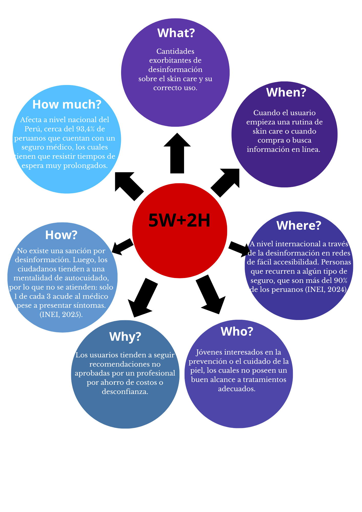
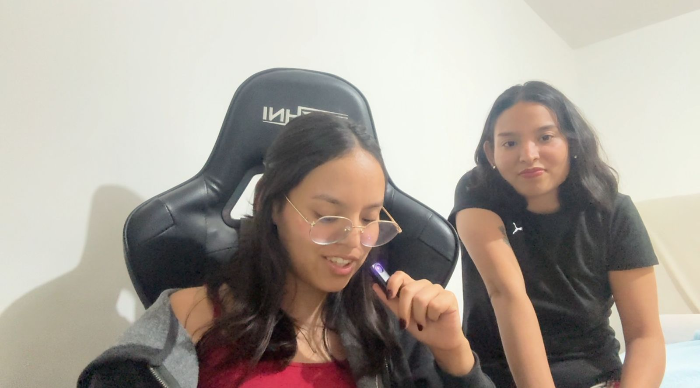
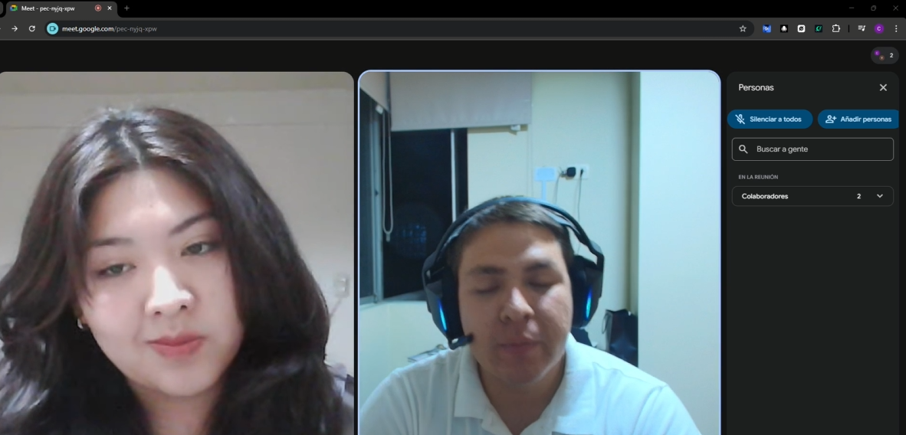
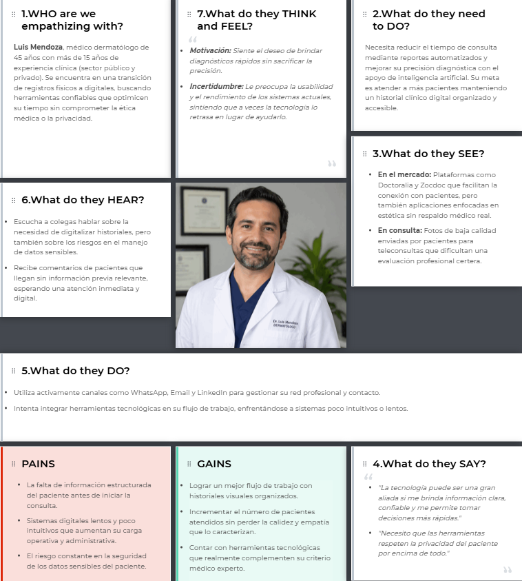
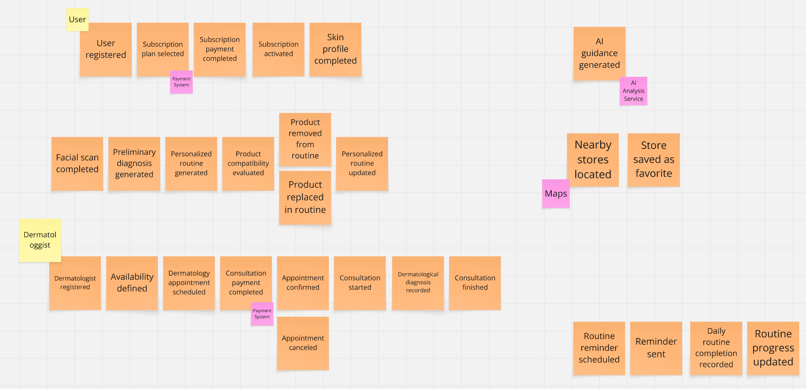

# Universidad Peruana de Ciencias Aplicadas

## Facultad de Ingeniería

## Programa Académico de Ingeniería de Software

**Ciclo:** 2026-10

**Curso:** Desarrollo de aplicaciones Open Source

**NRC:** 11881

**Docente del curso:** Efraín Ricardo Bautista Ubillús

# Informe de Trabajo Final

**Nombre de la Startup:** Dermacare

**Nombre del producto:** Bloomie

## Integrantes

u202416272 - Asmat Alminco, Martin Alejandro 
u202414802 - Contreras Torres, Arturo Valentino 
u202414970 - Gallardo Morales, Carla Alejandra 
u20241b843 - Mechan Montenegro, Luciana Carolina 
u202415551 - Ramirez Ruiz, Nickolas

*Abril, 2026*

---

# Registro de Versiones del Informe

| Versión | Fecha | Autor | Descripción de modificación |
|---------|-------|-------|-----------------------------|
| | | | |

---

# Project Report Collaboration Insights

---

# Contenido

## Tabla de Contenidos

- [Universidad Peruana de Ciencias Aplicadas](#universidad-peruana-de-ciencias-aplicadas)
  - [Facultad de Ingeniería](#facultad-de-ingeniería)
  - [Programa Académico de Ingeniería de Software](#programa-académico-de-ingeniería-de-software)
- [Informe de Trabajo Final](#informe-de-trabajo-final)
  - [Integrantes](#integrantes)
- [Registro de Versiones del Informe](#registro-de-versiones-del-informe)
- [Project Report Collaboration Insights](#project-report-collaboration-insights)
- [Contenido](#contenido)
  - [Tabla de Contenidos](#tabla-de-contenidos)
- [Student Outcome](#student-outcome)
  - 
- [Capítulo I: Introducción](#capítulo-i-introducción)
  - [1.1. Startup Profile](#11-startup-profile)
    - [1.1.1. Descripción de la Startup](#111-descripción-de-la-startup)
    - [Misión](#misión)
    - [Visión](#visión)
    - [Valores](#valores)
    - [1.1.2. Perfiles de integrantes del equipo](#112-perfiles-de-integrantes-del-equipo)
    - [Perfil del Integrante](#perfil-del-integrante)
  - [1.2. Solution Profile](#12-solution-profile)
    - [Descripción de la Solución](#descripción-de-la-solución)
    - [1.2.1. Antecedentes y problemática](#121-antecedentes-y-problemática)
        - [Metodología 5W+2H](#metodología-5w2h)
          - [What (Qué)](#what-qué)
          - [When (Cuándo)](#when-cuándo)
          - [Where (Dónde)](#where-dónde)
          - [Who (Quién)](#who-quién)
          - [Why (Por qué)](#why-por-qué)
          - [How (Cómo)](#how-cómo)
        - [How much (Cuánto)](#how-much-cuánto)
    - [1.2.2. Lean UX Process](#122-lean-ux-process)
      - [1.2.2.1. Lean UX Problem Statements](#1221-lean-ux-problem-statements)
      - [1.2.2.2. Lean UX Assumptions](#1222-lean-ux-assumptions)
      - [1.2.2.3. Lean UX Hypothesis Statements](#1223-lean-ux-hypothesis-statements)
      - [1.2.2.4. Lean UX Canvas](#1224-lean-ux-canvas)
  - [1.3. Segmentos objetivo](#13-segmentos-objetivo)
      - [Segmento 1: Jóvenes adultos de 21 a 30 años interesados en el cuidado de la piel](#segmento-1-jóvenes-adultos-de-21-a-30-años-interesados-en-el-cuidado-de-la-piel)
      - [Segmento 2: Dermatólogos certificados](#segmento-2-dermatólogos-certificados)
- [Capítulo II: Requirements Elicitation \& Analysis](#capítulo-ii-requirements-elicitation--analysis)
  - [2.1. Competidores](#21-competidores)
      - [Skin Bliss](#skin-bliss)
      - [Miiskin Skin Tracker](#miiskin-skin-tracker)
      - [First Derm](#first-derm)
    - [2.1.1. Análisis competitivo](#211-análisis-competitivo)
  - [Competitive Analysis Landscape](#competitive-analysis-landscape)
    - [2.1.2. Estrategias y tácticas frente a competidores](#212-estrategias-y-tácticas-frente-a-competidores)
  - [2.2. Entrevistas](#22-entrevistas)
    - [2.2.1. Diseño de entrevistas](#221-diseño-de-entrevistas)
      - [Segmento 1: Jóvenes adultos interesados en skincare](#segmento-1-jóvenes-adultos-interesados-en-skincare)
      - [Segmento 2: Dermatólogos certificados](#segmento-2-dermatólogos-certificados-1)
    - [2.2.2. Registro de entrevistas](#222-registro-de-entrevistas)
    - [2.2.3. Análisis de entrevistas](#223-análisis-de-entrevistas)
      - [Segmento 1:  Jóvenes adultos interesados en el skin care](#segmento-1--jóvenes-adultos-interesados-en-el-skin-care)
          - [Proceso de atención](#proceso-de-atención)
          - [Información esencial del paciente](#información-esencial-del-paciente)
          - [Dificultades antes de la consulta presencial](#dificultades-antes-de-la-consulta-presencial)
          - [Seguimiento de pacientes](#seguimiento-de-pacientes)
          - [Limitaciones de herramientas digitales](#limitaciones-de-herramientas-digitales)
          - [Problemas en pacientes con skincare propio](#problemas-en-pacientes-con-skincare-propio)
          - [Nivel de información del paciente](#nivel-de-información-del-paciente)
          - [Uso de IA en diagnósticos preliminares](#uso-de-ia-en-diagnósticos-preliminares)
          - [Historial visual estructurado](#historial-visual-estructurado)
          - [Funcionalidades indispensables](#funcionalidades-indispensables)
          - [Casos de uso recomendados](#casos-de-uso-recomendados)
      - [Segmento 2:  Dermatólogos certificados](#segmento-2--dermatólogos-certificados)
          - [Rutina de cuidado de la piel](#rutina-de-cuidado-de-la-piel)
          - [Fuentes de información para decisiones](#fuentes-de-información-para-decisiones)
          - [Proceso de elección de productos](#proceso-de-elección-de-productos)
          - [Problemas con productos de skincare](#problemas-con-productos-de-skincare)
          - [Relación con dermatólogos y expertos](#relación-con-dermatólogos-y-expertos)
          - [Nivel de confianza en la información presente en internet](#nivel-de-confianza-en-la-información-presente-en-internet)
          - [Interés en aplicaciones de skincare](#interés-en-aplicaciones-de-skincare)
          - [Expectativas de la solución](#expectativas-de-la-solución)
          - [Barreras o preocupaciones](#barreras-o-preocupaciones)
  - [2.3. Needfinding](#23-needfinding)
    - [2.3.1. User Personas](#231-user-personas)
    - [2.3.2. User Task Matrix](#232-user-task-matrix)
    - [2.3.3. User Journey Mapping](#233-user-journey-mapping)
      - [2.3.3.1 Segmento 1: Jóvenes adultos](#2331-segmento-1-jóvenes-adultos)
      - [2.3.3.2 Segmento 2: Dermatólogos certificados](#2332-segmento-2-dermatólogos-certificados)
    - [2.3.4. Empathy Mapping](#234-empathy-mapping)
      - [2.3.4.1 Segmento 1: Jóvenes adultos](#2341-segmento-1-jóvenes-adultos)
      - [2.3.4.2 Segmento 2: Dermatólogos certificados](#2342-segmento-2-dermatólogos-certificados)
  - [2.4. Big Picture Event Storming](#24-big-picture-event-storming)
  - [2.5. Ubiquitous Language](#25-ubiquitous-language)
- [Capítulo III: Requirements Specification](#capítulo-iii-requirements-specification)
  - [3.1. User Stories](#31-user-stories)
  - [3.2. Impact Mapping](#32-impact-mapping)
  - [3.3. Product Backlog](#33-product-backlog)
- [Capítulo IV: Product Design](#capítulo-iv-product-design)
  - [4.1. Style Guidelines](#41-style-guidelines)
    - [4.1.1. General Style Guidelines](#411-general-style-guidelines)
    - [4.1.2. Web Style Guidelines](#412-web-style-guidelines)
  - [4.2. Information Architecture](#42-information-architecture)
    - [4.2.1. Organization Systems](#421-organization-systems)
    - [4.2.2. Labeling Systems](#422-labeling-systems)
    - [4.2.3. SEO Tags and Meta Tags](#423-seo-tags-and-meta-tags)
    - [4.2.4. Searching Systems](#424-searching-systems)
    - [4.2.5. Navigation Systems](#425-navigation-systems)
  - [4.3. Landing Page UI Design](#43-landing-page-ui-design)
    - [4.3.1. Landing Page Wireframe](#431-landing-page-wireframe)
    - [4.3.2. Landing Page Mock-up](#432-landing-page-mock-up)
  - [4.4. Web Applications UX/UI Design](#44-web-applications-uxui-design)
    - [4.4.1. Web Applications Wireframes](#441-web-applications-wireframes)
    - [4.4.2. Web Applications Wireflow Diagrams](#442-web-applications-wireflow-diagrams)
    - [4.4.3. Web Applications Mock-ups](#443-web-applications-mock-ups)
    - [4.4.4. Web Applications User Flow Diagrams](#444-web-applications-user-flow-diagrams)
  - [4.5. Web Applications Prototyping](#45-web-applications-prototyping)
  - [4.6. Domain-Driven Software Architecture](#46-domain-driven-software-architecture)
    - [4.6.1. Design-Level Event Storming](#461-design-level-event-storming)
    - [4.6.2. Software Architecture Context Diagram](#462-software-architecture-context-diagram)
    - [4.6.3. Software Architecture Container Diagrams](#463-software-architecture-container-diagrams)
    - [4.6.4. Software Architecture Components Diagrams](#464-software-architecture-components-diagrams)
  - [4.7. Software Object-Oriented Design](#47-software-object-oriented-design)
    - [4.7.1. Class Diagrams](#471-class-diagrams)
  - [4.8. Database Design](#48-database-design)
    - [4.8.1. Database Diagrams](#481-database-diagrams)
- [Capítulo V: Product Implementation, Validation \& Deployment](#capítulo-v-product-implementation-validation--deployment)
  - [5.1. Software Configuration Management](#51-software-configuration-management)
    - [5.1.1. Software Development Environment Configuration](#511-software-development-environment-configuration)
    - [5.1.2. Source Code Management](#512-source-code-management)
    - [5.1.3. Source Code Style Guide \& Conventions](#513-source-code-style-guide--conventions)
    - [5.1.4. Software Deployment Configuration](#514-software-deployment-configuration)
  - [5.2. Landing Page, Services \& Applications Implementation](#52-landing-page-services--applications-implementation)
    - [5.2.1. Sprint 1](#521-sprint-1)
      - [5.2.1.1. Sprint Planning 1](#5211-sprint-planning-1)
      - [5.2.1.2. Aspect Leaders and Collaborators](#5212-aspect-leaders-and-collaborators)
      - [5.2.1.3. Sprint Backlog 1](#5213-sprint-backlog-1)
      - [5.2.1.4. Development Evidence for Sprint Review](#5214-development-evidence-for-sprint-review)
      - [5.2.1.5. Execution Evidence for Sprint Review](#5215-execution-evidence-for-sprint-review)
      - [5.2.1.6. Services Documentation Evidence for Sprint Review](#5216-services-documentation-evidence-for-sprint-review)
      - [5.2.1.7. Software Deployment Evidence for Sprint Review](#5217-software-deployment-evidence-for-sprint-review)
      - [5.2.1.8. Team Collaboration Insights during Sprint](#5218-team-collaboration-insights-during-sprint)
- [Conclusiones](#conclusiones)
  - [Conclusiones y recomendaciones](#conclusiones-y-recomendaciones)
  - [Video About-the-Team](#video-about-the-team)
- [Bibliografía](#bibliografía)
- [Anexos](#anexos)

---

# Student Outcome

El curso contribuye al cumplimiento del Student Outcome ABET:

**ABET – EAC - Student Outcome 3**

**Criterio:** *Capacidad de comunicarse efectivamente con un rango de audiencias.*

En el siguiente cuadro se describe las acciones realizadas y enunciados de conclusiones por parte del grupo, que permiten sustentar el haber alcanzado el logro del ABET – EAC - Student Outcome 3.

<table>
  <tr>
    <th>Criterio específico</th>
    <th>Acciones realizadas</th>
    <th>Conclusiones</th>
  </tr>

  <tr>
    <td><b>Comunica oralmente con efectividad a diferentes rangos de audiencia.</b></td>
    <td>
      Asmat Alminco, Martin Alejandro  
      <b>AV1</b>  
      

      Contreras Torres, Arturo Valentino  
      <b>AV1</b>  
      

      Gallardo Morales, Carla Alejandra  
      <b>AV1</b>  
      

      Mechan Montenegro, Luciana Carolina  
      <b>AV1</b>  
      

      Ramirez Ruiz, Nickolas  
      <b>AV1</b>
    </td>
    <td></td>
  </tr>

  <tr>
    <td><b>Comunica por escrito con efectividad a diferentes rangos de audiencia.</b></td>
    <td>
      Asmat Alminco, Martin Alejandro  
      <b>AV1</b>  
      

      Contreras Torres, Arturo Valentino  
      <b>AV1</b>  
      

      Gallardo Morales, Carla Alejandra  
      <b>AV1</b>  
      

      Mechan Montenegro, Luciana Carolina  
      <b>AV1</b>  
      

      Ramirez Ruiz, Nickolas  
      <b>AV1</b>
    </td>
    <td></td>
  </tr>
</table>
---

# Capítulo I: Introducción

## 1.1. Startup Profile

### 1.1.1. Descripción de la Startup

Hoy en día, el cuidado personal ha tomado gran relevancia, lo que ha convertido al mercado del skincare en uno de los más dinámicos y en constante crecimiento. Cada vez más personas, tanto jóvenes como adultos, buscan alternativas que les permitan mantener una piel saludable y cuidar su apariencia. Sin embargo, este creciente interés ha traído consigo la necesidad de soluciones innovadoras que conecten las expectativas de los usuarios con herramientas confiables, accesibles y basadas en información objetiva.

Es en este escenario que nace Dermacare, una startup comprometida en ayudar a las personas a comprender y gestionar su rutina de cuidado de la piel de manera informada y personalizada. Como parte de esta propuesta surge Bloomie, una aplicación web y móvil que integra servicios de Inteligencia Artificial para analizar el estado de la piel a partir de imágenes y generar recomendaciones personalizadas.

Bloomie se posiciona como el núcleo de la solución, brindando una experiencia digital intuitiva que acompaña al usuario en la toma de decisiones relacionadas con su cuidado personal. A través de la combinación de análisis automatizado, seguimiento de la evolución de la piel y acceso a servicios dermatológicos, la plataforma busca convertirse en un aliado confiable en el día a día del usuario.

---

### Misión

Brindamos una guía integral y personalizada para el cuidado de la piel mediante el uso de servicios de inteligencia artificial y análisis de datos dermatológicos. Ofrecemos rutinas adaptadas a cada tipo de piel, recomendaciones de productos ajustadas al presupuesto y objetivos del usuario, así como herramientas digitales accesibles que promueven hábitos de skincare saludables y sostenibles.

---

### Visión

Convertirnos en la plataforma líder de cuidado de la piel a nivel global, reconocida por integrar análisis inteligente y validación profesional como base para generar rutinas personalizadas y efectivas. Nuestro propósito es impactar positivamente en millones de personas, ayudándoles a prevenir y tratar problemas dermatológicos, al mismo tiempo que fortalecemos su confianza y bienestar.

---

### Valores

- **Accesibilidad:**  
  En Dermacare creemos que el cuidado de la piel debe estar al alcance de todos. Nuestra plataforma está diseñada para ser intuitiva y fácil de usar, adaptándose a distintos niveles de conocimiento y presupuestos.

- **Innovación:**  
  Integramos servicios de inteligencia artificial para transformar la experiencia del skincare, ofreciendo recomendaciones basadas en datos y en constante mejora. Apostamos por la tecnología como motor de soluciones modernas y efectivas.

- **Confianza:**  
  La salud de la piel requiere respaldo y seguridad. Por ello, combinamos análisis automatizados con la posibilidad de acceso a profesionales dermatológicos, fortaleciendo la credibilidad de la plataforma.

- **Bienestar:**  
  Más allá de la estética, buscamos mejorar la calidad de vida de nuestros usuarios. Promovemos hábitos de cuidado que fortalecen la salud de la piel y contribuyen a su bienestar integral.

### 1.1.2. Perfiles de integrantes del equipo

### Perfil del Integrante

<table>
  <tr>
    <td rowspan="4" align="center">
      
    </td>
    <td><b>Nombre:</b> Carla Alejandra Gallardo Morales</td>
  </tr>
  <tr>
    <td><b>Código:</b> u202414970 </td>
  </tr>
  <tr>
    <td>
      <b>Descripción:</b> 
      Soy <b>Carla Alejandra Gallardo Morales</b>, tengo 19 años. Desde que me incorporé en la Universidad Peruana de Ciencias Aplicadas en el periodo 2024-01, es decir que ahora mismo estoy cursando el quinto ciclo de la carrera de Ing. de Software, he adquirido y desarrollado distintos conocimientos a cerca de la programación, específicamente en el lenguaje C++ y Java, además, de forma autodidacta y extracurricular, he profundizado en el lenguaje Python, lo que ha ampliado mi perspectiva sobre la lógica y resolución de problemas.
        
        Dentro del equipo, mi contribución se basa en el apoyo continuo del desarrollo del backend y frontend de nuestro aplicativo, asimismo ayudo en la implementación del informe de nuestro proyecto.
    </td>
  </tr>
</table>

<table>
  <tr>
    <td rowspan="4" align="center">
      
    </td>
    <td><b>Nombre:</b> Arturo Valentino Contreras Torres</td>
  </tr>
  <tr>
    <td><b>Código:</b> u202414802</td>
  </tr>
  <tr>
    <td>
      <b>Descripción:</b> 
      Soy <b>Arturo Valentino Contreras Torres</b>, tengo 19 años y estudio la carrera de Ingeniería de Software en la UPC, actualmente estoy en el 5to ciclo. Me gusta aprender y aplicar tecnologías innovadoras para resolver problemas complejos y desarrollar soluciones eficientes. Me apasiona participar en concursos de programación en donde aprendo más sobre temas como programación competitiva, lenguajes como C++, Python, Java, frameworks como Flutter y habilidades como el trabajo en equipo.
        
      Dentro del equipo, contribuyo en el desarrollo frontend y backend, asegurándome de aplicar principios de Domain Driven Design, patrones de diseño y buenas prácticas de desarrollo de software. Me considero una persona responsable, creativa y orientada al trabajo en equipo, con un enfoque en la mejora continua frente a nuevos desafíos.
    </td>
  </tr>
</table>

<table>
  <tr>
    <td rowspan="4" align="center">
      
    </td>
    <td><b>Nombre:</b> Luciana Carolina Mechan Montenegro</td>
  </tr>
  <tr>
    <td><b>Código:</b> u20241b843</td>
  </tr>
  <tr>
    <td>
      <b>Descripción:</b> 
      Soy <b>Luciana Carolina Mechan Montenegro</b>, estudiante del quinto ciclo de la carrera de Ingeniería de Software. Cuento con conocimientos en lenguajes de programación como C++, Python y Java, los cuales he aplicado en distintos proyectos académicos orientados a la resolución de problemas y desarrollo de sistemas.
        
      Dentro del equipo, mi contribución se enfoca tanto en el desarrollo frontend como backend, participando en la implementación de funcionalidades y en la integración de los distintos componentes del sistema. Me caracterizo por ser responsable, proactiva y con una alta capacidad de aprendizaje, además de tener facilidad para el trabajo en equipo y la adaptación a nuevos retos dentro del proyecto.
    </td>
  </tr>
</table>
<table>
  <tr>
    <td rowspan="4" align="center">
      
    </td>
    <td><b>Nombre:</b> Nickolas Ramirez Ruiz</td>
  </tr>
  <tr>
    <td><b>Código:</b> u202415551</td>
  </tr>
  <tr>
    <td>
      <b>Descripción:</b> 
      Soy <b>Nickolas Ramirez Ruiz</b>, estudiante del quinto ciclo de la carrera de Ingeniería de Software.  
       A lo largo de mi formación académica he adquirido conocimientos en programación, principalmente utilizando el lenguaje Java. Además, durante mis primeros ciclos, tuve la oportunidad de iniciarme en la programación con el lenguaje C++ a través del entorno de desarrollo Visual Studio. Me considero una persona organizada, comprometida y con un enfoque proactivo, siempre buscando cumplir con mis responsabilidades antes del tiempo previsto.
    </td>
  </tr>
</table>

<table>
  <tr>
    <td rowspan="4" align="center">
      
    </td>
    <td><b>Nombre:</b> Martin Alejandro Asmat Alminco </td>
  </tr>
  <tr>
    <td><b>Código:</b> u202416272 </td>
  </tr>
  <tr>
    <td>
      <b>Descripción:</b> 
      Soy <b>Martin Alejandro Asmat Alminco</b>, estudiante de quinto ciclo de la carrera de Ingeniería de Software. Cuento con experiencia en lenguajes de programación como Python y C++ para proyectos enfocados en el desarrollo de habilidades computacionales, las cuales apliqué en proyectos académicos enfocados en solucionar un problema a través de procesos de documentación de Ingeniería de software.
        
        Dentro del equipo, cumplo el rol de un full stack al realizar actividades de documentación y programación a un nivel medio. Considero que soy una persona responsable y adaptable a distintas situaciones con buen time-management.  
    </td>
  </tr>
</table>

## 1.2. Solution Profile
### Descripción de la Solución

Nuestra solución consiste en una aplicación web y móvil denominada Bloomie, diseñada para asistir a personas interesadas en el cuidado de la piel mediante un sistema de análisis inteligente y personalizado. La aplicación permite que los usuarios registren un perfil personal y suban fotografías de su rostro, las cuales son procesadas a través de servicios de Inteligencia Artificial para identificar características relevantes de la piel, como presencia de acné, manchas, arrugas o textura desigual.

A partir de este análisis, Bloomie genera recomendaciones personalizadas de productos y hábitos de skincare, adaptadas a las necesidades específicas de cada usuario. A diferencia de otras soluciones basadas únicamente en cuestionarios, la plataforma combina el análisis automatizado con la posibilidad de acceso a servicios dermatológicos, brindando una experiencia más confiable y completa.

Asimismo, la aplicación permite realizar un seguimiento de la evolución de la piel a lo largo del tiempo, facilitando la comparación de resultados y la mejora continua de las rutinas recomendadas. Adicionalmente, integra funcionalidades como la visualización de productos disponibles en el mercado y la localización de puntos de compra cercanos.

El modelo de negocio de Bloomie se basa en un esquema de suscripción escalonado, en el cual los usuarios pueden acceder a distintos niveles de personalización, seguimiento y soporte según el plan contratado. Este enfoque permite ofrecer una solución accesible para distintos perfiles de usuario, al mismo tiempo que garantiza la sostenibilidad del servicio.

Como parte de la evolución del producto, se contempla la integración futura de dispositivos IoT orientados al monitoreo de condiciones de la piel, lo que permitirá complementar el análisis y mejorar la precisión de las recomendaciones, sin que ello represente una dependencia en la versión actual del sistema.
 confu
Para el sistema de análisis inteligente, se considerará el uso de Inteligencia Artificial (IA) para aplicación de algoritmos que logren Aprendizaje automático para aprender comportamiento o patrones con previo criterio programado. Dicho criterio constará de estudios sobre el cuidado de la piel para luego poder realizar comparaciones y diferenciar tipos de piel. Para ello, nos apoyaremos de la subdisciplina de IA: Visión de Computadora para que esta pueda interpretar información significativa a través de imágenes o videos.

### 1.2.1. Antecedentes y problemática

El interés por el cuidado de la piel ha incrementado de manera significativa en jóvenes y adultos que buscan prevenir o tratar afecciones cutáneas comunes. Según el Fortune Business Insight (2024), el mercado de skincare fue valorado en 115.6 mil millones de dólares y se estima que crezca a 194 mil millones en el año 2032. Sin embargo, dicha relevancia adquirida generó una sobreoferta de productos y desinformación sobre el cuidado de piel. Diariamente, los usuarios se enfrentan a cientos de marcas, auspiciadores y catálogos de cosméticos extenuantes, lo que genera confusión en la correcta adquisición de dichos productos y dificulta la elección de una rutina apta para el usuario.

En adición, existe una brecha en la atención dermatológica para los ciudadanos. Esto se debe las largas colas de espera por aseguradoras, como EsSalud, que se estima un tiempo de espera entre un par de semanas hasta 5 meses (INFOBAE, 2024). 

##### Metodología 5W+2H
   
###### What (Qué)   
Cantidades exorbitantes de desinformación sobre el skincare y su correcto uso, lo que genera que las personas realicen rutinas y utilicen productos que no son apropiados para su tipo de piel. Ello implica pérdidas de dinero y causar efectos adversos en la piel.

###### When (Cuándo)
Cuando el usuario desea continuar o empezar una rutina de skincare, comprar productos o buscar información en línea. 

Luego, nuestra aplicación será utilizada cuando nuestro usuario decida investigar o evaluar el tipo de rutina que necesita, que necesita la búsqueda de productos por geolocalización así como también desee consultar con un profesional de forma rápida y segura.

###### Where (Dónde)
Se encuentra a nivel nacional peruano por desinformación en redes de fácil accesibilidad así como también personas que recurren a algún tipo de seguro, que son más del 90% de los peruanos (INEI, 2024).

Nuestra aplicación puede ser utilizada en contextos cotidianos por parte de los usuarios, como el hogar o el trabajo, donde puedan dedicar un tiempo a la visualización de la rutina y notificaciones en el transcurso del día con respecto a su tratamiento. 

###### Who (Quién)
La aplicación será utilizada por cualquier persona que esté interesada en el cuidado de la piel y busquen prevenir o tratar afecciones cutáneas, pero no tiene acceso fácil a un dermatólogo.

###### Why (Por qué)
El problema surge porque los usuarios tienden a seguir recomendaciones no aprobadas por un profesional por ahorro de costos o desconfianza. Luego, existe el caso donde no son capaces de poder directamente acceder a un tratamiento profesional por factores económicos, demográficos, etc. 

###### How (Cómo)

La razón por la cual el problema no se encuentra en su estado óptimo, es porque no hay una regulación clara con penalizaciones severas por compartir información errónea. También, las personas tienden a intentar solucionar sus problemas independientemente antes de consultar con un profesional, ya que, según el INEI (2025), solo 1 de cada 3 cuidadanos acude a atención médica pese a presentar algún malestar. 
Luego, existe que mucha de la información que pese a que provenga de un  estudio científico, no es garantizado el satisfacer las necesidades particulares de cada tipo de piel. 

Con nuestra propuesta, se disminuye los intentos de autocuidado por muchas personas al integrar posibles soluciones personalizables y brindar la posibilidad de conectar con profesionales que cubran con sus necesidades específicas. 

##### How much (Cuánto)

El problema es amplio y afecta a una gran cantidad de personas. En relación con los efectos adversos causados por una mala elección de dermocosméticos, Nayak et al. (2023) realizó una encuesta con 400 participantes y los resultados fueron claros: el 44 % experimentó efectos negativos, de los cuales el 25,5 % correspondió al rostro. Además, el estudio reveló que solo el 15 % de las mujeres consultó a un dermatólogo, mientras que un 22,25 % optó por la automedicación, lo que refleja la ausencia de orientación profesional en la mayoría de casos.

A continucación, el gráfico de la técnica 5W+2H: 

 

      
    

### 1.2.2. Lean UX Process

#### 1.2.2.1. Lean UX Problem Statements

 En el dominio de la salud y bienestar enfocado en el cuidado de la piel, los jóvenes adultos de 21 a 30 años, especialmente estudiantes universitarios y jóvenes profesionales familiarizados con aplicaciones móviles, enfrentan múltiples dificultades al momento de cuidar su piel. La sobrecarga de información contradictoria en redes sociales, la falta de personalización en las recomendaciones, y la tendencia a la automedicación, lo cual muchas veces produce un efecto adverso, generan frustración, gastos innecesarios y resultados poco efectivos, además de no contar con herramientas que les permitan hacer un seguimiento real de su progreso.

Asimismo, las soluciones actuales no logran cubrir estas necesidades de manera integral, ya que se basan en métodos genéricos y carecen de análisis más precisos y personalizados. Esto evidencia la oportunidad de ofrecer una solución accesible y confiable que permita a los usuarios tomar decisiones informadas, mejorar continuamente el cuidado de su piel y evitar los riesgos asociados a la desinformación.

¿Cómo podríamos ayudar a los jóvenes adultos a acceder a una experiencia personalizada, confiable y efectiva que optimice el cuidado de su piel y reduzca los efectos secundarios?

#### 1.2.2.2. Lean UX Assumptions

- Assumptions Worksheet:
  - Creemos que nuestros usuarios necesitan identificar correctamente su tipo y estado de piel para poder elegir productos de skincare adecuados, ya que actualmente existe una gran cantidad de información contradictoria y una amplia variedad de productos en el mercado que genera confusión y malas decisiones.
  - Estas necesidades pueden resolverse mediante la aplicación Bloomie, la cual permitirá a los usuarios analizar su piel a través de imágenes utilizando inteligencia artificial, brindando recomendaciones personalizadas de productos y hábitos de cuidado.
  - Nuestros clientes iniciales serán jóvenes adultos interesados en el cuidado de la piel y con acceso a dispositivos tecnológicos, pero no cuentan con el conocimiento suficiente para elegir productos adecuados para su tipo de piel o necesidades.
  - El principal valor que los usuarios esperan de nuestro servicio es contar con una herramienta confiable, práctica, fácil de usar y personalizada que les permita mejorar el estado de su piel sin necesidad de invertir tiempo y dinero en distintos productos o consultas innecesarias.
  - Los usuarios también podrán obtener beneficios adicionales como el seguimiento continuo de la evolución de su piel, la comparación de resultados a lo largo del tiempo y el acceso a orientación profesional mediante consultas con dermatólogos.
  - Planeamos adquirir la mayoría de nuestros usuarios a través de estrategias de marketing digital, principalmente mediante redes sociales, contenido educativo sobre skincare, colaboraciones con creadores de contenido y campañas publicitarias dirigidas a nuestros segmentos objetivos.
  - Generaremos ingresos mediante un modelo de suscripción escalonado (sin planes free), que permitirá a los usuarios acceder a diferentes niveles de personalización, seguimiento y servicios adicionales de Bloomie. Asimismo, se contempla la posibilidad de generar ingresos a través de alianzas con marcas de productos dermatológicos.
  - Nuestra competencia principalmente estará conformada por aplicaciones de skincare que ofrecen recomendaciones genéricas o análisis básicos de la piel, así como contenido no especializado en redes sociales que influye en las decisiones que toman los usuarios.
  - Nos diferenciaremos al ofrecer un enfoque integral basado en inteligencia artificial, análisis de imágenes, seguimiento continuo y la posibilidad de acceso a dermatólogos, lo que permitirá brindar recomendaciones más precisas, confiables y personalizadas.
  - Nuestro mayor riesgo de producto es que los usuarios no confíen inicialmente en el análisis de imágenes para identificar el tipo de piel o no adopten el uso continuo de la aplicación.
  - Planeamos mitigar este riesgo mediante la generación de confianza a través de resultados visibles, validación con especialistas dermatológicos, experiencia de usuario intuitiva y estrategias de educación digital sobre el uso adecuado de la aplicación.

  <b>¿Quién es el usuario?</b> 
  Se trata de jóvenes adultos entre 21 y 30 años, incluyendo estudiantes universitarios y jóvenes profesionales, que muestran interés en el cuidado de la piel y consumen contenido relacionado con skincare en redes sociales.
  Estos usuarios cuentan con acceso a dispositivos móviles y están familiarizados con el uso de aplicaciones digitales. Sin embargo, enfrentan dificultades para elegir productos adecuados debido a la gran cantidad de información contradictoria que existe en internet.
  Además, suelen experimentar problemas como acné, manchas o sensibilidad en la piel, que los motiva a buscar soluciones efectivas. Esta situación los lleva a invertir en productos que muchas veces no generan los resultados esperados, provocando frustración y desconfianza en los usuarios. También consideramos a dermatólogos certificados que interactúan con la aplicación para validar diagnósticos y atender consultas virtuales de manera más eficiente.
   

   <b>¿Dónde encaja nuestro producto en su trabajo o vida?</b> 
   Para los jóvenes adultos, Bloomie se integra como parte de su rutina diaria de cuidado personal, permitiéndoles analizar el estado de su piel, recibir recomendaciones personalizadas y realizar seguimiento continuo de su evolución.  
   La aplicación acompaña al usuario en momentos clave, como la elección de productos, la evaluación de resultados y la mejora progresiva de su rutina de skincare.  
   Para los dermatólogos, Bloomie encaja como una herramienta de apoyo en su práctica profesional, facilitando el acceso a información previa del paciente, optimizando el tiempo de consulta y permitiendo un seguimiento más estructurado y eficiente. Además, de facilitar la conexión con clientes con problemas en el cuidado de su piel.
   

   <b>¿Qué problemas tiene nuestro producto? ¿Resolver?</b> 
   Nuestro producto debe resolver la confusión causada por la publicidad engañosa y las recomendaciones contradictorias que existen acerca de productos o rutinas de skincare, evitando que los usuarios realicen gastos innecesarios y efectos adversos. También debe responder a la dificultad de acceso a consultas dermatológicas por sus altos costos y largas esperas. En el caso de los dermatólogos, busca eliminar la dependencia de descripciones subjetivas de los pacientes y ofrecer información, además de facilitar la relación médico - paciente.
   

   <b>¿Cuándo y cómo es usado nuestro producto?</b> 
   Bloomie será utilizado principalmente en el hogar, de forma diaria o periódica, permitiendo a los usuarios analizar su piel mediante imágenes, revisar recomendaciones personalizadas y registrar su progreso.  
   También será utilizado en momentos específicos, como antes de adquirir productos de skincare, donde el usuario podrá consultar sugerencias adecuadas a sus necesidades.  
   En el caso de los dermatólogos, la aplicación será utilizada durante consultas virtuales o seguimientos, facilitando el acceso a información previa del paciente y mejorando la toma de decisiones.

   

   <b>¿Qué características son importantes?</b> 
   La precisión del análisis de imágenes mediante inteligencia artificial es fundamental para garantizar recomendaciones confiables y adaptadas a cada usuario.  
   Asimismo, la privacidad y seguridad de los datos personales, especialmente de las imágenes faciales, es un aspecto crítico para generar confianza en el usuario.  
   La interfaz debe ser intuitiva y fácil de usar, permitiendo una navegación clara y accesible para distintos niveles de experiencia digital.
   

   <b>¿Cómo debe verse nuestro producto y cómo comportarse?</b> 
   Bloomie debe presentar un diseño moderno, limpio y profesional, transmitiendo confianza y seguridad desde el primero contacto con el usuario. La interfaz debe ser intuitiva, con una estructura clara, uso de colores suaves y jerarquía visual que facilite la comprensión de la información mostrada, como diagnósticos, recomendaciones y seguimiento.  
   En cuanto a su comportamiento, la aplicación debe ser ágil y fluida, con tiempos de respuestas rápidos en el procesamiento de imágenes y navegación. Además, debe actuar de manera proactiva mediante notificaciones inteligentes, recordatorios de rutina y sugerencias personalizadas incentivando la constancia del usuario en el cuidado de su piel.

   

- Business Outcomes:
  - Posicionar a Bloomie como una solución confiable en el cuidad de la piel mediante uso de inteligencia artificial y análisis personalizado
  - Generar ingresos a través de un modelo de suscripción escalonado, reflejado en el aumento progresivo de usuarios de los diferentes planes que existen en Bloomie
  - Reducir la incertidumbre y el gasto innecesario en productos de skincare no adecuados, mejorando la satisfacción del usuario con los resultados obtenidos
  - Establecer alianzas con dermatólogos certificados, ampliando el alcance del servicio y fortaleciendo la propuesta de valor de la plataforma
  - Ser un producto tecnológico con una interfaz sencilla y fácil de entender para el cuidado de la piel de los usuarios
 

- User Outcomes:
  - <b>Mayor comprensión del estado de su piel:</b>  
  Los usuarios podrán conocer con mayor precisión las características de su piel mediante el análisis de imágenes procesadas por inteligencia artificial, lo que permitirá tomar decisiones mejor informadas.
  - <b>Obtención de recomendaciones personalizadas:</b>  
  A partir del análisis de piel realizado, los usuarios recibirán sugerencias adaptadas a necesidades específicas, incluyendo productos y hábitos adecuados para su tipo de piel.
  - <b>Reducción de gastos innecesarios:</b>  
  Gracias a la información de Bloomie, los usuarios evitarán invertir en productos ineficaces, optimizando su presupuesto destinado al cuidado personal.
  - <b>Seguimiento continuo de la evolución de la piel:</b>  
  Los usuarios podrán registrar y comparar el estado de su piel a lo largo del tiempo, facilitando la evaluación de resultados y la mejora continua de la rutina de skincare.
  - <b>Acceso a orientación profesional:</b>  
  Los usuarios podrán fortalecer su rutina de cuidado de la piel mediante la posibilidad de consultar dermatólogos, obteniendo una experiencia más confiable y completa.
 

- Features:
  - Registro de usuarios para gestionar su perfil personal y características de la piel
  - Análisis de imágenes del rostro mediante inteligencia artificial para identificar condiciones como acné, manchas o textura irregular
  - Generación de recomendaciones personalizadas de productos y rutinas de skincare
  - Historial de seguimiento con registro de imágenes para comparar la evolución de la piel
  - Visualización de productos disponibles en el mercado relacionados con las recomendaciones generales propuestas por la app
  - Integración con servicios dermatológicos para consultas y seguimiento profesional
  - Notificaciones y sugerencias inteligentes basadas en cambios detectados en la piel
  - Interfaz intuitiva y fácil de usar, adaptada a usuarios con diferentes niveles de experiencia digital
 

#### 1.2.2.3. Lean UX Hypothesis Statements

- Hipotesis de negocio: 
  - <b>Creemos que</b> ofrecer recomendaciones personalizadas basadas en análisis de la piel permitirá a los usuarios tomar mejores decisiones sobre productos de skincare. <b>Sabremos que</b> hemos tenido éxito <b>cuando</b> observemos un aumento del 10% en la retención de usuarios mensuales.
  - <b>Creemos que</b> implementar un modelo de suscripción escalonado permitirá atender a usuarios con diferentes necesidades y niveles de compromiso. <b>Sabremos que</b> hemos tenido éxito <b>cuando</b> logremos que al menos el 15% de los usuarios que visitan la plataforma se suscriban a algún plan.
  - <b>Creemos que</b> integrar el acceso a dermatólogos dentro de la plataforma incrementará la confianza en la solución. <b>Sabremos que</b> hemos tenido éxito <b>cuando</b> al menos el 20% de los usuarios premium utilicen funcionalidades relacionadas a consultas o validación profesional.
   

- Hipotesis de usuario: 
  - <b>Creemos que</b> los usuarios necesitan una forma confiable de identificar productos adecuados para su tipo de piel, por lo que valorarán recibir recomendaciones personalizadas. <b>Sabremos que</b> hemos tenido razón <b>cuando</b> al menos el 60% de los usuarios interactúen con las recomendaciones generadas.
  - <b>Creemos que</b> los usuarios valoran el seguimiento visual de su progreso y estarán más motivados a mantener su rutina si pueden visualizar la evolución de su piel. <b>Sabremos que</b> hemos tenido éxito <b>cuando</b> al menos el 50% de los usuarios registren y consulten su historial de manera recurrente.
  - <b>Creemos que</b> los usuarios tienen dificultades para identificar correctamente su tipo y estado de piel, por lo que valorarán una funcionalidad de análisis de imágenes que les permita obtener información más precisa y confiable. <bmos>Sabremos que</b> hemos tenido éxito <b>cuando</b> al menos el 70% de los usuarios utilicen la función de análisis de imagen de manera recurrente.
  
#### 1.2.2.4. Lean UX Canvas

  

## 1.3. Segmentos objetivo
Bloomie identifica dos segmentos principales de usuarios, definidos a partir del dominio del problema y respaldados por estadísticas del contexto peruano.

#### Segmento 1: Jóvenes adultos de 21 a 30 años interesados en el cuidado de la piel

Este segmento comprende estudiantes universitarios y jóvenes profesionales residentes en zonas urbanas del Perú, con acceso a dispositivos móviles y alta exposición a contenido digital sobre skincare. Se trata de un público con capacidad de gasto en productos de cuidado personal y con hábitos de consumo digital consolidados.
En términos de capacidad económica, según el MTPE (2024), el ingreso laboral promedio mensual del grupo de 25 a 44 años ascendió a S/ 1,847 en el período abril 2023–marzo 2024, siendo el grupo de mayor ingreso promedio por edad. Esto indica que este segmento cuenta con ingresos suficientes para sostener un modelo de suscripción como el propuesto por Bloomie. Respecto al comportamiento digital, el 80% de los usuarios peruanos de redes sociales las utilizan de forma diaria (Statista, 2023), confirmando que el segmento objetivo tiene una presencia digital intensa que facilita tanto la adopción de la aplicación como el consumo de contenido de skincare.
Respecto al mercado de skincare en Perú, según COPECOH–CCL, el consumo promedio per cápita en rutinas de skincare asciende a S/ 828 al año, impulsado por el crecimiento de los dermocosméticos, que han aumentado hasta en 100% en comparación con años anteriores. Además, la categoría de tratamiento facial fue la de mayor crecimiento dentro del sector, registrando un aumento del 32% en 2023, lo que evidencia una demanda activa y creciente en el tipo de orientación que Bloomie busca brindar.

#### Segmento 2: Dermatólogos certificados
Este segmento comprende a médicos dermatólogos colegiados y en ejercicio activo que buscan herramientas digitales para optimizar su práctica clínica, ampliar su alcance a pacientes y ofrecer servicios de teleconsulta o seguimiento remoto. Bloomie les ofrece una plataforma para conectar con usuarios que ya cuentan con un análisis previo de su piel, lo que permite consultas más informadas y eficientes.
En el Perú, la distribución de especialistas dermatólogos es marcadamente desigual: la mayoría se concentra en Lima y en las principales ciudades del país, mientras que en regiones periféricas la oferta es escasa o nula. Esta concentración geográfica limita el acceso de gran parte de la población a atención especializada, generando una demanda insatisfecha que plataformas como Bloomie pueden canalizar digitalmente. Asimismo, el consumo promedio peruano en productos de higiene y cuidado personal entre los 15 y 65 años alcanza USD 225 anuales, con un crecimiento del 3% respecto al período anterior (COPECOH–CCL, 2024), lo que refleja una base de usuarios con disposición real a invertir en su salud dermatológica, representando una oportunidad concreta para que los especialistas amplíen su práctica a través de canales digitales.

# Capítulo II: Requirements Elicitation & Analysis

## 2.1. Competidores
#### Skin Bliss 
Skin Bliss es una aplicación móvil que utiliza inteligencia artificial para analizar la piel y 
recomendar rutinas personalizadas. Permite a los usuarios crear un perfil de su piel, escanear 
productos para evaluar sus ingredientes y registrar un historial visual de cambios a lo largo del 
tiempo. Su fortaleza radica en la transparencia científica y en la personalización de rutinas 
según las características y necesidades de cada usuario. Sin embargo, sus servicios están 
limitados al ámbito preventivo y estético, ya que no incorpora validación médica profesional ni 
consultas con dermatólogos, lo que reduce la credibilidad clínica de sus recomendaciones. 

#### Miiskin Skin Tracker 
Miiskin está enfocada en el seguimiento visual de la piel, especialmente para controlar lunares 
y cambios en manchas, arrugas o texturas. Fue diseñada para un uso prolongado, permite 
comparar fotos a lo largo del tiempo y está en cumplimiento con estándares como HIPAA, lo 
que refuerza su legitimidad en telemedicina. Su fortaleza radica en el tratamiento médico y 
privacidad, aunque sus servicios se limitan a seguimiento visual sin ofrecer diagnóstico o 
recomendaciones de productos, no ofrece un sistema integral de análisis automatizado orientado a recomendaciones personalizadas de skincare.

#### First Derm 
First Derm es una plataforma de teledermatología donde los usuarios envían casos, incluyendo 
imágenes, para que dermatólogos certificados los evalúen. La app está disponible en iOS, 
Android y web, y ya ha atendido gran cantidad de casos en diferentes países. Su principal 
ventaja es el acceso directo a diagnóstico profesional, pero su enfoque es más médico que 
preventivo o educativo; no incluye análisis automatizado ni rutinas personalizadas, y no integra 
seguimiento visual continuo ni recomendaciones de productos.

### 2.1.1. Análisis competitivo

## Competitive Analysis Landscape
Como se observa en la siguiente tabla se desarrolló un proceso de análisis para determinar 
nuestro FODA frente a competidores. 

<table>
  <tr>
    <th colspan="6" align="left">Competitive Analysis Landscape</th>
  </tr>

  <tr>
    <td><b>¿Por qué llevar a cabo este análisis?</b></td>
    <td colspan="5">
      Conocer a profundidad a los principales competidores en el mercado digital del skincare (Skin Bliss, Miiskin Skin Tracker y First Derm), para identificar sus fortalezas, debilidades, oportunidades y amenazas, y así definir las ventajas competitivas y estrategias de Bloomie.
    </td>
  </tr>
  <tr>
    <th>Perfil</th>
    <th>Aspecto</th>
    <th>Bloomie</th>
    <th>Skin Bliss</th>
    <th>Miski Skin Tracer</th>
    <th>First Derm</th>
  </tr>

  <!-- OVERVIEW -->
  <tr>
    <td rowspan="2"><b>Perfil</b></td>
    <td><b>Overview</b></td>
    <td>Plataforma web y móvil que analiza la piel con IA, genera rutinas personalizadas, conecta con dermatólogos y permite seguimiento visual del progreso.</td>
    <td>App que combina escaneo facial con rutinas personalizadas, evaluaciones de ingredientes y seguimiento visual con fotos comparativas.</td>
    <td>App enfocada en el monitoreo de lunares y manchas, con comparativas fotográficas y alertas de cambios.</td>
    <td>Servicio de teledermatología donde dermatólogos certificados atienden casos enviados por usuarios a través de la app.</td>
  </tr>

  <tr>
    <td><b>Ventaja competitiva</b></td>
    <td>Integración en una sola plataforma de análisis automatizado, recomendaciones personalizadas, seguimiento continuo y acceso a dermatólogos.</td>
    <td>Ofrece análisis de piel, gestión de productos, programa de rutina y historial visual con lógica de ingredientes.</td>
    <td>Cumplimiento con estándares médicos (HIPAA), alta confianza en privacidad y seguridad.</td>
    <td>Acceso directo a dermatólogos en múltiples países con diagnóstico en menos de 24h.</td>
  </tr>

  <!-- MARKETING -->
  <tr>
    <td rowspan="2"><b>Perfil de Marketing</b></td>
    <td><b>Mercado objetivo</b></td>
    <td>Jóvenes y adultos interesados en skincare confiable, accesible y personalizado, así como dermatólogos.</td>
    <td>Usuarios interesados en skincare preventivo y estético.</td>
    <td>Pacientes preocupados por salud dermatológica (lunares, cáncer de piel, manchas).</td>
    <td>Personas con problemas serios en la piel que requieren diagnóstico rápido y seguro.</td>
  </tr>

  <tr>
    <td><b>Estrategias</b></td>
    <td>Marketing digital en redes sociales, alianzas estratégicas y posicionamiento en comunidades de skincare.</td>
    <td>Comunicación centrada en ciencia y seguridad, difusión en redes sociales y app stores.</td>
    <td>Alianzas con hospitales y dermatólogos, marketing en sector salud.</td>
    <td>Estrategias basadas en confianza médica y respaldo de especialistas.</td>
  </tr>

  <!-- PRODUCTO -->
  <tr>
    <td rowspan="4"><b>Perfil de Producto</b></td>
    <td><b>Productos y Servicios</b></td>
    <td>Diagnóstico mediante servicios de IA, rutinas personalizadas, historial visual, acceso a dermatólogos, mapa de farmacias y chatbot.</td>
    <td>Escaneo facial, creación de rutinas, análisis de ingredientes, historial visual y comparativas de productos.</td>
    <td>Seguimiento visual de lunares y manchas, comparaciones fotográficas y recordatorios.</td>
    <td>Consulta médica online, envío de fotos y diagnóstico profesional.</td>
  </tr>

  <tr>
    <td><b>Precios y Costos</b></td>
    <td>Modelo de suscripción escalonado con diferentes niveles de acceso según funcionalidades.</td>
    <td>Modelo freemium con suscripción mensual para funciones avanzadas.</td>
    <td>Freemium con opciones avanzadas de almacenamiento y seguimiento.</td>
    <td>Pago por consulta entre $30–40 por caso.</td>
  </tr>

  <tr>
    <td><b>Canales de distribución</b></td>
    <td>App móvil (iOS y Android), versión web y redes sociales.</td>
    <td>App móvil disponible en iOS y Android.
    </td>
    <td>App móvil (iOS y Android).</td>
    <td>App móvil y web.</td>
  </tr>

  <!-- SWOT -->
  <tr>
    <td><b>Fortalezas</b></td>
    <td>Integralidad diagnóstica, rutinas, validación médica y multiplataforma.</td>
    <td>Rutinas personalizadas, transparencia científica e historial visual.</td>
    <td>Seguridad médica, confianza y respaldo de estándares.</td>
    <td>Respaldo profesional y rapidez en diagnóstico.</td>
  </tr>

  <tr>
    <td rowspan="3"><b>Análisis SWOT</b></td>
    <td><b>Debilidades</b></td>
    <td>Requiere confianza del usuario para compartir fotos y mayor complejidad.</td>
    <td>No integra validación médica ni consultas dermatológicas.</td>
    <td>Sin recomendaciones personalizadas ni rutinas.</td>
    <td>No ofrece seguimiento ni personalización.</td>
  </tr>

  <tr>
    <td><b>Oportunidades</b></td>
    <td>Creciente interés en skincare y adopción de soluciones digitales en salud, junto con alianzas con marcas del sector.</td>
    <td>Integrar consultas médicas para mayor credibilidad.</td>
    <td>Crecimiento del mercado preventivo de skincare.</td>
    <td>Integración con IA y rutinas personalizadas.</td>
  </tr>

  <tr>
    <td><b>Amenazas</b></td>
    <td>Competencia de grandes marcas tecnológicas y desconfianza en datos.</td>
    <td>Apps más completas con diagnóstico clínico.</td>
    <td>Apps más atractivas enfocadas en estética.</td>
    <td>Alta competencia en telemedicina y costos.</td>
  </tr>

</table>

### 2.1.2. Estrategias y tácticas frente a competidores
- <b>Personalización integral con respaldo profesional: </b>
  Como estrategia principal, Bloomie se diferencia al integrar en una sola plataforma el análisis automatizado mediante servicios de IA y el acceso a dermatólogos. Esto permite afrontar la debilidad de competidores como Skin Bliss, que se enfocan únicamente en recomendaciones estéticas sin validación profesional. La táctica consiste en posicionar la aplicación como una solución confiable que combina tecnología y respaldo médico, fortaleciendo la confianza del usuario.

- <b>Seguimiento continuo orientado a la experiencia del usuario:</b>
  Frente a soluciones como Miiskin, cuyo enfoque principal es el monitoreo visual, Bloomie incorpora seguimiento acompañado de rutinas personalizadas y recordatorios inteligentes. Esta estrategia permite aprovechar la debilidad de la competencia en cuanto a falta de acompañamiento activo, mientras que la táctica se centra en mejorar la adherencia del usuario a su rutina mediante notificaciones y visualización de progreso.

- <b> Modelo de suscripción accesible y escalable: </b>
  A diferencia de First Derm, que maneja un modelo de pago por consulta, Bloomie adopta un esquema de suscripción escalonado que permite a los usuarios acceder a distintos niveles de servicio según sus necesidades. Esta estrategia aprovecha la oportunidad de captar un mercado más amplio con diferentes capacidades de pago, mientras que la táctica consiste en ofrecer valor progresivo a través de planes diferenciados.

- <b> Integración de funcionalidades en un solo ecosistema </b>
  Mientras que los competidores se enfocan en funcionalidades específicas, Bloomie apuesta por una estrategia de integración que centraliza diagnóstico, recomendaciones, seguimiento y acceso a servicios dermatológicos. La táctica consiste en reducir la fragmentación del proceso de cuidado de la piel, respondiendo a la debilidad de soluciones parciales y posicionando la plataforma como un ecosistema completo.

## 2.2. Entrevistas

### 2.2.1. Diseño de entrevistas

En esta sección se presenta el diseño de las entrevistas dirigidas a los segmentos objetivos con el propósito de recolectar información relevante que permita comprender sus necesidades, comportamientos y problemáticas. Para ello, se formularon las siguientes preguntas divididas en iniciales y principales, permitiendo que se asegure la obtención de datos de nuestros segmentos objetivos.

#### Segmento 1: Jóvenes adultos interesados en skincare
**Preguntas iniciales**
- ¿Qué edad tienes?
- ¿A qué te dedicas actualmente?
- ¿En qué distrito o ciudad resides?
- ¿Qué dispositivo utilizas con mayor frecuencia (celular, laptop, tablet)?

**Preguntas principales**
1. Cuéntame cómo es actualmente tu rutina de cuidado de la piel.
2. ¿Cómo decides qué productos de skincare utilizar?
3. ¿Qué dificultades has tenido al intentar seguir una rutina de cuidado de la piel?
4. ¿Qué haces cuando tienes un problema en la piel o no sabes qué producto usar?
5. ¿Qué tan confiable consideras la información que encuentras en redes sociales o internet sobre skincare? ¿Por qué?
6. ¿Has tenido alguna experiencia negativa al usar productos para tu piel? Cuéntame.
7. ¿Qué te frustra más del proceso de elegir productos o armar una rutina?
8. ¿Qué esperas lograr al cuidar tu piel?

**Preguntas de validación de solución**

9. ¿Cómo te sentirías al usar una aplicación que analice tu piel a partir de fotografías?
10. ¿Qué dudas o preocupaciones tendrías al compartir imágenes o información sobre tu piel en una app?
11. ¿Qué tendría que ofrecerte una aplicación para que confíes en sus recomendaciones?
12. ¿En qué situaciones usarías una aplicación así en tu día a día?
13. ¿Qué tendría que pasar para que sigas usando una aplicación como esta a largo plazo? 

#### Segmento 2: Dermatólogos certificados
**Preguntas iniciales**

- ¿Cuántos años de experiencia tienes como dermatólogo?
- ¿Trabajas de manera independiente o en una institución?
- ¿En qué ciudad o distrito ejerces actualmente?

**Preguntas principales**

1. ¿Cómo es actualmente tu proceso de atención a pacientes desde el diagnóstico hasta el seguimiento?
2. ¿Qué tipo de información del paciente consideras esencial antes de iniciar una consulta?
3. ¿Qué dificultades encuentras al evaluar a un paciente antes de verlo presencialmente?
4. ¿Cómo realizas actualmente el seguimiento de la evolución de tus pacientes?
5. ¿Qué limitaciones has identificado en las herramientas digitales que utilizas hoy en día?
6. ¿Qué problemas observas con mayor frecuencia en pacientes que siguen rutinas de skincare por su cuenta?
7. ¿Cómo percibes el nivel de información o desinformación de los pacientes respecto al cuidado de su piel?

**Preguntas de validación de solución**

8. ¿Qué opinas sobre el uso de inteligencia artificial como apoyo en diagnósticos preliminares?
9. ¿Qué valor tendría para ti contar con un reporte previo automatizado del estado de la piel del paciente?
10. ¿Qué tan útil sería tener acceso a un historial visual estructurado antes de la consulta?
11. ¿Qué barreras o preocupaciones tendrías al utilizar una herramienta digital de este tipo?
12. ¿Qué funcionalidades considerarías indispensables para integrar una solución como esta en tu práctica?
13. ¿En qué casos recomendarías a un paciente el uso de una aplicación como esta?
### 2.2.2. Registro de entrevistas

**PRIMER SEGMENTO OBJETIVO**

<u>Entrevista 1:</u>

Entrevistador: Carla Gallardo Morales

Datos del entrevistado

- **Nombre:** Fiorella  
- **Apellidos:** Gallardo Morales
- **Edad:** 25 años
- **Distrito:** La Molina
- **Timing:** 8:37 minutos
  

**Resumen descriptivo:**

Fiorella es una joven de 25 años que está interesada en el cuidado de su piel y por consiguiente, sigue una rutina básica de cuidado de la piel: por la mañana limpia su rostro y aplica protector solar, y por la noche utiliza una crema hidratante. Sin embargo, señala que no reaplica el protector durante el día.
 Menciona que uno de sus principales problemas es la dificultad para elegir productos debido a la gran variedad en el mercado. Para tomar decisiones, recurre a reseñas y recomendaciones en redes sociales como TikTok, aunque reconoce que no siempre son confiables, ya que cada piel reacciona de manera diferente. Incluso relata una experiencia negativa reciente con un producto que le causó sequedad.
Aunque ha considerado acudir a un dermatólogo, prefiere informarse por su cuenta. Respecto a aplicaciones de análisis de piel, indica que estaría dispuesta a usarlas por la orientación que brindan, aunque tiene ciertas preocupaciones sobre la privacidad de sus datos.
  Finalmente, señala que no confiaría únicamente en una sola plataforma y que continuaría usando una aplicación solo si las recomendaciones resultan efectivas.

<u>Entrevista 2:</u>

Entrevistador:Nickolas Ramirez Ruiz

Datos del entrevistado

- **Nombre:** Yamileth Sherlyn 
- **Apellidos:** Corimaya Cuello 
- **Edad:** 23 Años 
- **Ciudad:** Arequipa
- **Timing:** 11:37:22 minutos

**Resumen descriptivo:**
Llamileth Corimaya Cuello, una estudiante de Derecho de 23 años residente en Arequipa que se dedica a la asesoría legal y comercial, mantiene una rutina de cuidado de piel minimalista y tecnológica pero enfrenta dificultades con la dosificación y el orden de los productos tras experiencias negativas con especialistas, por lo que desconfía de las redes sociales y la piratería, prefiriendo guiarse por recomendaciones de amigas y mostrando una alta disposición a utilizar una aplicación eficiente que analice su piel mediante fotografías por las noches para obtener fuentes confiables y resultados seguros.

<u>Entrevista 3:</u>

Entrevistador: Luciana Mechan Montenegro

Datos del entrevistado

- **Nombre:** Britny 
- **Apellidos:** Alarcon
- **Edad:** 20
- **Distrito:** San Martín de Porres
- **Timing:** 

**Resumen descriptivo:**

La entrevistada, Britney, tiene 20 años, reside en San Martín de Porres y es estudiante de psicología. Utiliza principalmente el celular como su dispositivo principal y se informa sobre el cuidado de la piel a través de redes sociales, especialmente TikTok, complementándolo con búsquedas en Google. Su comportamiento refleja una alta dependencia de medios digitales y una influencia significativa de tendencias en redes, aunque mantiene una postura crítica respecto a la confiabilidad de esta información.

En cuanto a su rutina de skincare, presenta piel mixta a grasa y problemas como granitos, por lo que selecciona productos en función de estas características. Sin embargo, su proceso se basa en la prueba y error, ya que considera que cada piel reacciona de manera diferente. Su principal dificultad es la falta de constancia debido a su rutina diaria como estudiante, lo que le impide seguir adecuadamente los pasos del cuidado de la piel. Además, ha tenido experiencias negativas con productos que no cumplen lo prometido o generan reacciones adversas, lo que incrementa su frustración al momento de construir una rutina adecuada.

Finalmente, la entrevistada muestra interés en una aplicación que analice su piel y le brinde recomendaciones personalizadas, ya que facilitaría la toma de decisiones y le ofrecería una guía constante. Para confiar en este tipo de solución, considera importante que esté respaldada por dermatólogos y tecnología como inteligencia artificial. Asimismo, valora funcionalidades como recordatorios o notificaciones, que le ayudarían a mantener la constancia, aunque expresa preocupación por la privacidad de sus datos si la información no es manejada de forma personal.

 

**SEGUNDO SEGMENTO OBJETIVO**

<u>Entrevista 1:</u>

Entrevistador: Arturo Contreras Torres

Datos del entrevistado

- **Nombre:** Justo
- **Apellidos:** Valverde
- **Edad:** 48 años
- **Distrito:** San Martín de Porres
- **Timing:** 

**Resumen descriptivo:**

El entrevistado fue Justo Valverde, un médico con 22 años de experiencia, actualmente trabajando en una institución pública de salud. Justo describe que la atención médica sigue un proceso de entrevista clínica, diagnóstico y tratamiento. Señala que las consultas presenciales son más efectivas debido al apoyo de exámenes clínicos, mientras que las virtuales cumplen principalmente un rol informativo, aunque el seguimiento del paciente si puede realizarse de forma remota.  
Utiliza una aplicación para gestionar historiales clínicos, la cual, pese a ciertas fallas, ha mejorado su trabajo frente al uso tradicional del papel. Advierte sobre los riesgos de que los pacientes utilicen productos sin información adecuada y valora positivamente la integración de inteligencia artifical como herramienta informativa, siempre complementada por un profesional de la salud.  
Considera que nuestro producto, Bloomie, puede agilizar la atención médica al proporcionar información previa del paciente, permitiendo al especialista optimizar el tiempo de consulta y enfocarse en decisiones clínicas más precisas.

<u>Entrevista 2:</u>

Entrevistador: Martin Alejandro Asmat Alminco

Datos del entrevistado

- **Nombre:** Antonio
- **Apellidos:** Paredes 
- **Edad:** 67 años
- **Distrito:** Jesús María
- **Timing:** 

**Resumen descriptivo:** 

En entrevistado fue Antonio Paredes, un médico con 40 años de experiencia en la especialidad de dermatología, y que actualmente trabaja en una clínica privada ubicada en Jesús María. Él considera relevante para sus consultas un buen diagnóstico, para lo cual evalúa antecedentes, lesiones cutáneas o la automedicación. Sin embargo, considera que existen casos en los cuales se puede complicar el correcto tratamiento de los pacientes al casos completamente variantes, por lo que ve necesario un correcto historial clínico y uso de un sistema brindado por la clínica. Luego, se encuentra parcialmente en desacuerdo con el uso de productos relacionados con el skin care, ya que propone que en su mayoría, estos no contienen la certificación médica para poder ser utilizados de forma libre, lo que complica el tratamiento. 

Después, con respecto a una posible aplicación, menciona que se debe mantener un correcto uso de la información, no desde el lado técnico en software, sino información que en teoría está protegida por la ley y que tiene peso legal, ello por ejemplo incluye el historial clínico. Sin embargo, si ve pertinente la integración de una aplicación en formato puente, donde pueda unir a los dermatólogos y pacientes en un entorno con mayor comunicación para ahorro de tiempo yo costos a comparación del sistema de citas tradicional. 

Finalmente, el doctor está de acuerdo que las herramientas de inteligencia aertificial son beneficiosas para el uso cotidiano y de ser aplicable, para el caso de los dermatólogos especialistas como él. Sin embargo, considera que es pertinente la supervisión de profesionales debido a posibles diagnósticos erróneos generados por patrones, ya que los casos de pacientes se consideran únicos, especialmente por intentos de autocuidado. 

<u>Entrevista 3:</u>

Entrevistador: Luciana Mechan

Datos del entrevistado

- **Nombre:** Andrea 
- **Apellidos:** Rosas
- **Edad:** 45
- **Distrito:** San Isidro
- **Timing:** 

El entrevistado no autorizo para la grabación de su rostro  

**Resumen descriptivo:**

La entrevistada, Andrea Rosas, es dermatóloga con 30 años de experiencia, trabaja de manera independiente y ejerce en el distrito de San Isidro. Su proceso de atención inicia con la evaluación visual del paciente, seguido del diagnóstico y la prescripción del tratamiento, mientras que el seguimiento depende en gran medida de que el paciente regrese a consulta, lo cual no siempre ocurre. Para realizar un diagnóstico adecuado, considera esencial contar con información previa como historial dermatológico, alergias, medicamentos actuales, rutina de productos y antecedentes familiares; sin embargo, en la práctica suele iniciar desde cero debido a la falta de información previa estructurada por parte del paciente.

En cuanto a las herramientas digitales, la entrevistada señala que el seguimiento es principalmente manual, utilizando fotos tomadas con el celular o enviadas por WhatsApp, lo que evidencia la ausencia de un sistema especializado. Además, menciona que las historias clínicas electrónicas actuales no están adaptadas a las necesidades de la dermatología, ya que no permiten una adecuada gestión ni comparación visual de imágenes. También identifica como un problema frecuente que los pacientes sigan rutinas de skincare basadas en redes sociales, lo que genera daños en la piel y dificulta el diagnóstico, debido a la falta de conocimiento sobre ingredientes y el uso incorrecto de productos.

Finalmente, la dermatóloga muestra una percepción positiva hacia el uso de inteligencia artificial como herramienta de apoyo, siempre que no reemplace el criterio profesional. Considera que un reporte previo automatizado, acompañado de un historial visual estructurado y un resumen de productos utilizados, aportaría un alto valor al proceso de consulta, ya que permitiría ahorrar tiempo y mejorar la precisión del diagnóstico. Asimismo, identifica como principales beneficios el seguimiento de la evolución del paciente y la optimización de consultas, aunque expresa preocupación por la posible mala interpretación de resultados por parte de los usuarios. Indica que recomendaría este tipo de solución especialmente en pacientes con tratamientos prolongados, como el acné, donde el monitoreo constante resulta clave.

**Enlace del video único de las entrevistas:** [*Ver grabación aquí*](https://upcedupe-my.sharepoint.com/:v:/g/personal/u202414802_upc_edu_pe/IQBNkNJeD-G7TZeChphX-tz0AXsuN0Qpx9bOQVOKp_op9rk?nav=eyJyZWZlcnJhbEluZm8iOnsicmVmZXJyYWxBcHAiOiJPbmVEcml2ZUZvckJ1c2luZXNzIiwicmVmZXJyYWxBcHBQbGF0Zm9ybSI6IldlYiIsInJlZmVycmFsTW9kZSI6InZpZXciLCJyZWZlcnJhbFZpZXciOiJNeUZpbGVzTGlua0NvcHkifX0&e=mt5kc7)

### 2.2.3. Análisis de entrevistas

#### Segmento 1:  Jóvenes adultos interesados en el skin care 

###### Proceso de atención 
100% realiza diagnóstico mediante evaluación clínica (visual + anamnesis)
66.7% incluye exámenes complementarios en casos necesarios
100% considera la consulta presencial como más efectiva
33.3% reconoce que el seguimiento puede hacerse de forma remota

###### Información esencial del paciente
100% considera esencial el historial médico (enfermedades, alergias, medicación)
100% requiere conocer productos/rutinas del paciente
66.7% incluye antecedentes familiares o contexto adicional (ocupación, enfermedades sistémicas)

###### Dificultades antes de la consulta presencial
100% reporta falta de información previa estructurada
100% indica que pacientes llegan con la condición alterada (automedicación/productos)
66.7% menciona problemas por demora en citas o evolución de la lesión

###### Seguimiento de pacientes
100% no cuenta con un sistema de seguimiento completamente estructurado y  dentro de este grupo, solo el 66,7 % cuenta con un sistema por parte de su hospital o clínica.
33.3% realiza seguimiento manual (fotos, mensajería) debido a posibles consultas virtuales.
66.7% depende de consultas presenciales porque consideran que es lo mejor en tratamiento.
33.3% reconoce viabilidad del seguimiento remoto 

###### Limitaciones de herramientas digitales
66.7% considera que las herramientas actuales son básicas o poco adaptadas
66.7% reporta dificultades en manejo/comparación de imágenes
33.3% utiliza sistemas digitales que mejoran frente al papel, pero con limitaciones
66.7% teme mala interpretación por parte del paciente
33.3% menciona riesgos generales asociados al uso de la herramienta

###### Problemas en pacientes con skincare propio
100% observa uso incorrecto de productos por intentos de autocuidado 
100% reporta efectos negativos en la piel (irritación, alteraciones)
66.7% menciona uso excesivo o múltiples productos simultáneos

###### Nivel de información del paciente
100% percibe desinformación generalizada
100% identifica influencia de redes sociales y marketing
66.7% señala falta de criterio o comprensión sobre productos

######  Uso de IA en diagnósticos preliminares
100% considera la IA útil como apoyo
100% coincide en que no reemplaza al profesional

###### Historial visual estructurado
100% lo considera útil o muy útil
66.7% destaca impacto en seguimiento y evaluación clínica

###### Funcionalidades indispensables
100% requiere acceso a información previa del paciente
66.7% considera clave el historial visual comparativo
33.3% valora gestión digital de historiales clínicos

###### Casos de uso recomendados
100% recomienda uso para optimizar consulta médica
66.7% lo enfoca en seguimiento de tratamientos
33.3% lo considera útil como apoyo informativo para pacientes 

#### Segmento 2:  Dermatólogos certificados

###### Rutina de cuidado de la piel
100% sigue alguna rutina de skincare por cuenta propia o tratada. 
33.3% presenta uso incorrecto o incompleto pese a recomendaciones de profesionales. 
33.3% reporta dificultad explícita para mantener constancia.
66.7% presenta problemas implícitos en la piel.

###### Fuentes de información para decisiones
66.7% utiliza redes sociales como fuente principal de casos verídicos y primeras referencias antes de comprar un producto.
33.3% prefiere recomendaciones cercanas de familiares o amigos. 
33.3% complementa con búsquedas en Google para averiguar mayor información. 
66.7% reconoce que la información no es confiable 
33.3% desconfía activamente de redes sociales

###### Proceso de elección de productos
100% presenta dificultad para elegir productos
66.7% basa sus decisiones en prueba y error
66.7% considera que cada piel reacciona diferente
33.3% tiene problemas específicos con el orden o dosificación

###### Problemas con productos de skincare
100% ha tenido experiencias negativas
33.3% reporta resequedad
33.3% reporta irritaciones o reacciones adversas
33.3% menciona malas experiencias con especialistas o recomendaciones.

###### Relación con dermatólogos y expertos
33.3% ha considerado acudir a un dermatólogo
33.3% ha tenido experiencias negativas con especialistas
100% no tiene acompañamiento profesional constante
66.7% prefiere autogestionar su cuidado

###### Nivel de confianza en la información presente en internet
100% muestra desconfianza hacia fuentes actuales
66.7% mantiene una postura crítica pero sigue usándolas
33.3% evita activamente fuentes digitales no confiables

###### Interés en aplicaciones de skincare
100% estaría dispuesto a usar una app de análisis de piel
66.7% busca guía constante en internet sobre los posibles productos para aplicarse. 
33.3% busca fuentes confiables y seguras de farmacias y atención al médico.

###### Expectativas de la solución
100% espera recomendaciones personalizadas sobre rutina y productos. 
33.3% valora recordatorios o notificaciones por parte de la aplicaicón.
33.3% espera análisis mediante fotografías o scanners al sentir mayor seriedad y profesioanlismo. 
33.3% busca precisión en uso (orden/dosificación) de sus productos.

###### Barreras o preocupaciones
66.7% tiene preocupación por privacidad de datos
33.3% no lo menciona explícitamente pero sí exige confiabilidad
33.3% muestra desconfianza general por experiencias previas
33.3% menciona importancia de IA confiable

## 2.3. Needfinding

### 2.3.1. User Personas

En esta sección se presentan los user personas construidos a partir del análisis de las entrevistas realizadas a usuarios y especialistas dermatológicos. Estos artefactos sintetizan patrones de comportamiento, necesidades, motivaciones y frustraciones identificadas durante la investigación, permitiendo representar de manera clara a los segmentos clave de nuestro proyecto.

**PRIMER SEGMENTO OBJETIVO**

 

**SEGUNDO SEGMENTO OBJETIVO**

### 2.3.2. User Task Matrix

### 2.3.3. User Journey Mapping
En esta sección se detallan los User Journey Maps en su versión "As-Is", uno por cada segmento de usuario definido. El objetivo de estos mapas es ilustrar el proceso de extremo a extremo que realizan actualmente los usuarios para intentar resolver su necesidad, evidenciando los puntos de dolor, las frustraciones y las ineficiencias que experimentan antes de la implementación de nuestra solución propuesta.

A continuación, se presentan los diagramas que resumen la situación actual de los usuarios:
####  2.3.3.1 Segmento 1: Jóvenes adultos

#### 2.3.3.2 Segmento 2: Dermatólogos certificados

### 2.3.4. Empathy Mapping
En esta sección se presenta el Empathy Mapping elaborado para el segmento de negocio. Esta herramienta nos permite profundizar en el conocimiento de nuestro User Persona, yendo más allá de las características demográficas para comprender sus dolores, necesidades y el entorno que influye en su toma de decisiones.

A continuación, se visualizan los aspectos psicográficos, frustraciones y metas que definen la experiencia del usuario respecto a la problemática identificada:
####  2.3.4.1 Segmento 1: Jóvenes adultos

#### 2.3.4.2 Segmento 2: Dermatólogos certificados

## 2.4. Big Picture Event Storming

En esta sección se presenta el proceso de Big Picture Event Storming realizado por el equipo, con el propósito de comprender el dominio del negocio de manera general y visualizar sus procesos más relevantes. A través de una sesión colaborativa, se identificaron los principales eventos del dominio, los actores involucrados y sus relaciones, permitiendo obtener una primera visión integral del funcionamiento del sistema. Este modelado de alto nivel ayudó a reconocer flujos clave del negocio, así como posibles problemas, oportunidades y puntos de mejora dentro del contexto del proyecto.

Para realizar el Big Picture Event Storming se utilizaron 3 pasos importantes:

- **Step 1: Generating Domain Events**  
  En esta primera etapa se reconocieron los eventos más importantes del dominio del negocio, es decir, aquellos sucesos significativos que reflejan un cambio relevante dentro del sistema. Estos eventos fueron redactados en pasado, ya que representan hechos que ya ocurrieron, y sirvieron como punto de partida para entender el comportamiento general del negocio.

  

    
  
  

- **Step 2: Sorting Domain Events (chronologically)**  
  Luego, los eventos identificados se organizaron de manera cronológica, con el fin de representar el flujo general de las actividades del negocio. Esta secuencia permitió observar con mayor claridad cómo se conectan los distintos sucesos y cómo evolucionan los procesos dentro del dominio.

  

    
  
  

- **Step 3: Adding Actors and External systems**  
  Finalmente, se añadieron los actores y sistemas externos que intervienen en los procesos del negocio. Esto permitió identificar quiénes participan en cada interacción y qué elementos externos influyen en el desarrollo de los eventos, brindando así una visión más completa del contexto en el que opera el sistema.

  

    
  
  

## 2.5. Ubiquitous Language

En esta sección se define el lenguaje ubicuo del dominio del negocio, el cual permite establecer una comunicación clara, consistente y sin ambigüedades entre todos los stakeholders del proyecto, incluyendo desarrolladores, diseñadores y usuarios del sistema.

El Ubiquitous Language se construye a partir de términos propios del dominio del cuidado de la piel (skincare), la atención dermatológica y la personalización de rutinas, evitando el uso de conceptos técnicos de ingeniería de software.

Este lenguaje debe mantenerse consistente a lo largo de todo el proyecto, incluyendo la definición de requerimientos, User Stories, modelos de dominio y diseño del sistema.

 <u> Glosario de Términos del Dominio </u> 

- **User (Usuario)**  
  Persona que utiliza la aplicación para analizar su piel, recibir recomendaciones personalizadas y realizar seguimiento de su rutina de cuidado.

- **Dermatologist (Dermatólogo)**  
  Profesional de la salud especializado en el cuidado de la piel que brinda consultas, diagnósticos y recomendaciones a los usuarios dentro de la plataforma.

- **Skin Analysis (Análisis de piel)**  
  Proceso mediante el cual se evalúa el estado de la piel del usuario, generalmente a partir de imágenes o información proporcionada, para identificar condiciones y necesidades específicas.

- **Skin Type (Tipo de piel)**  
  Clasificación de la piel del usuario (por ejemplo: seca, grasa, mixta o sensible), utilizada como base para personalizar recomendaciones.

- **Skin Condition (Condición de la piel)**  
  Estado específico de la piel en un momento determinado, incluyendo problemas como acné, manchas, irritación o deshidratación.

- **Routine (Rutina)**  
  Conjunto estructurado de pasos y productos recomendados que el usuario debe seguir para el cuidado de su piel.

- **Routine Step (Paso de rutina)**  
  Acción específica dentro de una rutina, como limpieza, hidratación o aplicación de un producto.

- **Routine Tracking (Seguimiento de rutina)**  
  Registro del cumplimiento diario de la rutina por parte del usuario, utilizado para medir consistencia y progreso.

- **Adherence (Adherencia)**  
  Indicador que refleja qué tan consistentemente el usuario sigue su rutina a lo largo del tiempo.

- **Streak (Racha)**  
  Cantidad de días consecutivos en los que el usuario ha cumplido su rutina.

- **Product (Producto)**  
  Artículo de cuidado de la piel recomendado al usuario como parte de su rutina, con base en su análisis de piel.

- **Product Compatibility (Compatibilidad del producto)**  
  Nivel en el que un producto es adecuado para la piel del usuario según su tipo, condición y rutina actual.

- **Catalog (Catálogo)**  
  Conjunto de productos disponibles que el usuario puede explorar dentro de la aplicación.

- **Appointment (Cita)**  
  Interacción programada entre el usuario y un dermatólogo para recibir asesoría profesional.

- **Consultation (Consulta)**  
  Sesión de atención entre el usuario y el dermatólogo, en la cual se evalúa el estado de la piel y se brindan recomendaciones.

- **Diagnosis (Diagnóstico)**  
  Evaluación realizada por el dermatólogo sobre la condición de la piel del usuario, acompañada de recomendaciones.

- **Recommendation (Recomendación)**  
  Sugerencia de productos, hábitos o tratamientos basada en el análisis de piel o en la evaluación del dermatólogo.

- **Subscription Plan (Plan de suscripción)**  
  Modelo de acceso mediante el cual el usuario obtiene las funcionalidades de la aplicación a cambio de un pago.

- **Availability (Disponibilidad)**  
  Horario definido por el dermatólogo en el cual puede atender consultas.

- **Skin Progress (Progreso de la piel)**  
  Evolución del estado de la piel del usuario a lo largo del tiempo, basada en el seguimiento y análisis continuo.

# Capítulo III: Requirements Specification

## 3.1. User Stories
En esta sección se presentan los requerimientos del sistema definidos mediante un conjunto de User Stories y Epics, los cuales describen de manera clara y concisa las funcionalidades esperadas desde la perspectiva de los diferentes actores del sistema, tales como el usuario joven adulto, el dermatólogo, el visitante del sitio web y el desarrollador.

Cada User Story representa una necesidad específica del negocio y está orientada a generar valor dentro del contexto del cuidado personalizado de la piel.

Asimismo, cada User Story incluye uno o más criterios de aceptación redactados en tercera persona, en tiempo presente y siguiendo la estructura de Gherkin (Given–When–Then). Estos criterios permiten definir comportamientos verificables del sistema, asegurando que las funcionalidades puedan ser validadas de manera objetiva.

El conjunto de User Stories se encuentra organizado en Epics, los cuales agrupan funcionalidades relacionadas dentro de los distintos contextos del dominio, tales como gestión de usuarios, rutinas, atención dermatológica, experiencia web y servicios REST. Esta organización facilita la comprensión del sistema y su evolución incremental.

Finalmente, se incluyen tanto User Stories funcionales orientadas al usuario final como Technical Stories asociadas a la implementación de servicios RESTful, permitiendo cubrir tanto la perspectiva del negocio como los aspectos necesarios para la construcción del sistema.

<table border="1" cellspacing="0" cellpadding="8">

  <tr>
    <th>Epic / Story ID</th>
    <th>Título</th>
    <th>Descripción</th>
    <th>Criterios de Aceptación</th>
    <th>Relacionado con (Epic ID)</th>
  </tr>

  <tr>
    <td><strong>US01</strong></td>
    <td>Registro básico</td>
    <td>
      Como joven adulto, quiero registrarme con mis datos personales 
      para crear una cuenta y acceder a Bloomie.
    </td>
    <td>
      <strong>Escenario 1: Registro exitoso</strong> 
      Dado que el usuario proporciona datos válidos
      Cuando confirma el registro
      Entonces el sistema valida la información
      Y crea la cuenta correctamente
      

      <strong>Escenario 2: Datos inválidos</strong> 
      Dado que el usuario ingresa datos inválidos o incompletos
      Cuando intenta registrarse
      Entonces el sistema rechaza la solicitud
      Y muestra mensajes de error
    </td>
    <td>E1(Onboarding de usuario)</td>
  </tr>

  <tr>
    <td><strong>US02</strong></td>
    <td>Completar perfil básico de piel</td>
    <td>
      Como joven adulto, quiero completar un cuestionario inicial de 
      hábitos y condiciones de piel en mi primer ingreso para que la 
      aplicación configure diagnósticos y rutinas personalizadas. 
    </td>
    <td>
      <strong>Escenario 1: Registro exitoso</strong> 
      Dado que el usuario accede por primera vez a la aplicación
      Cuando el sistema valida su autenticación
      Entonces solicita completar información inicial sobre hábitos y condiciones de piel
      

      <strong>Escenario 2: Registro exitoso de información</strong> 
      Dado que el usuario proporciona información completa sobre sus hábitos y condiciones de piel
      Cuando confirma el envío
      Entonces el sistema guarda la información correctamente
      Y permite continuar con el proceso de análisis
      

      <strong>Escenario 3: Información incompleta</strong> 
      Dado que el usuario no proporciona información obligatoria sobre sus hábitos o condiciones de piel
      Cuando intenta continuar
      Entonces el sistema impide el avance
      Y solicita completar los datos requeridos     
    </td>
    <td>E1(Onboarding de usuario)</td>
  </tr>

  <tr>
    <td><strong>US03</strong></td>
    <td>Escaneo facial con cámara</td>
    <td>
      Como joven adulto, quiero realizar un escaneo facial moviendo mi 
      cabeza frente a la cámara para que la aplicación capture imágenes 
      desde diferentes ángulos y obtenga un diagnóstico preciso de mi tipo de piel. 
    </td>
    <td>
      <strong>Escenario 1: Escaneo completado</strong> 
      Dado que el usuario inicia el proceso de escaneo facial
      Cuando el sistema captura correctamente las imágenes necesarias     
      Entonces el sistema completa el escaneo
      Y continúa con el análisis de la piel
      

      <strong>Escenario 2: Escaneo incompleto</strong> 
      Dado que el usuario inicia el proceso de escaneo facial
      Cuando el proceso no se completa correctamente
      Entonces el sistema indica que el escaneo no fue completado
      Y permite reintentar el proceso    
    </td>
    <td>E2(Análisis de piel)</td>
  </tr>

  <tr>
    <td><strong>US04</strong></td>
    <td>Diagnóstico preliminar automático</td>
    <td>
      Como joven adulto, quiero recibir un reporte preliminar generado por 
      la inteligencia artificial después del escaneo facial para conocer el 
      estado de mi piel y entender qué tipo de cuidados necesito. 
    </td>
    <td>
      <strong>Escenario 1: Diagnóstico procesado correctamente</strong> 
      Dado que el usuario completó el escaneo
      Cuando el sistema procesa las imágenes mediante servicios de IA
      Entonces identifica condiciones de la piel
      Y genera un reporte preliminar
      

      <strong>Escenario 2: Error de procesamiento interno o conexión</strong> 
      Dado que ocurre un error en el procesamiento
      Cuando el sistema no puede analizar las imágenes
      Entonces informa al usuario
      Y permite reintentar
    </td>
    <td>E2(Análisis de piel)</td>
  </tr>

<tr>
    <td><strong>US05</strong></td>
    <td>Generar rutina personalizada con productos</td>
    <td>
      Como joven adulto, quiero recibir una rutina personalizada con productos específicos basados en mi diagnóstico de piel para seguir un tratamiento adecuado. 
    </td>
    <td>
      <strong>Escenario 1: Generación de rutina con productos</strong> 
      Dado que el usuario cuenta con un diagnóstico de piel
      Cuando accede a su rutina
      Entonces el sistema genera una rutina personalizada
      Y asigna productos específicos para cada paso
      

      <strong>Escenario 2: Rutina adaptada al contexto del usuario</strong> 
      Dado que el usuario cuenta con información de preferencias o presupuesto
      Cuando el sistema genera la rutina
      Entonces selecciona productos acordes a sus condiciones
      

      <strong>Escenario 3: Error en la generación de la rutina</strong> 
      Dado que el usuario cuenta con un diagnóstico registrado
      Cuando ocurre un error en la generación de la rutina
      Entonces el sistema informa la situación
      Y permite reintentar el proceso
    </td>
    <td>E3(Gestión de rutina personalizada)</td>
  </tr>

  <tr>
    <td><strong>US06</strong></td>
    <td>Adaptar rutina mediante reemplazo de productos</td>
    <td>
      Como joven adulto, quiero modificar los productos sugeridos en mi rutina para adaptarlos a mis necesidades o disponibilidad. 
    </td>
    <td>
      <strong>Escenario 1: Solicitar reemplazo de producto</strong> 
      Dado que el usuario tiene una rutina activa
      Cuando selecciona la opción de reemplazar un producto
      Entonces el sistema muestra alternativas compatibles con la rutina
      

      <strong>Escenario 2: Evaluación de compatibilidad del reemplazo</strong> 
      Dado que el usuario selecciona un producto alternativo
      Cuando el sistema analiza su compatibilidad con la rutina actual
      Entonces determina si el producto es adecuado
      Y presenta el nivel de compatibilidad
      

      <strong>Escenario 3: Confirmación de reemplazo</strong> 
      Dado que el usuario selecciona un producto compatible
      Cuando confirma el cambio
      Entonces el sistema actualiza la rutina
      Y reemplaza el producto anterior
      

      <strong>Escenario 4: Eliminación de producto de la rutina</strong> 
      Dado que el usuario tiene una rutina activa
      Cuando decide eliminar un producto
      Entonces el sistema actualiza la rutina
      Y elimina el paso correspondiente
    </td>
    <td>E3(Gestión de rutina personalizada)</td>
  </tr>

  <tr>
    <td><strong>US07</strong></td>
    <td>Recordatorios de rutina</td>
    <td>
      Como joven adulto, quiero recibir recordatorios para cumplir con mi rutina de cuidado de la piel y mantener constancia. 
    </td>
    <td>
      <strong>Escenario 1: Envío de recordatorio</strong> 
      Dado que el usuario tiene una rutina activa
      Y ha definido horarios de uso
      Cuando llega el momento programado
      Entonces el sistema envía un recordatorio
      Y permite acceder a la rutina
      

      <strong>Escenario 2: Recordatorios desactivados</strong> 
      Dado que el usuario tiene una rutina activa
      Cuando desactiva los recordatorios
      Entonces el sistema deja de enviar notificaciones
    </td>
    <td>E3(Gestión de rutina personalizada)</td>
  </tr>

  <tr>
    <td><strong>US08</strong></td>
    <td>Explorar catálogo de productos con filtros </td>
    <td>
      Como joven adulto, quiero explorar un catálogo de productos y aplicar filtros para encontrar opciones relevantes a mis necesidades.
    </td>
    <td>
      <strong>Escenario 1: Visualización del catálogo</strong> 
      Dado que el usuario accede al catálogo de productos
      Cuando el sistema carga la información
      Entonces muestra una lista de productos disponibles
      

      <strong>Escenario 2: Aplicación de filtros</strong> 
      Dado que el usuario se encuentra en el catálogo
      Cuando aplica criterios de filtrado
      Entonces el sistema muestra productos que cumplen con dichos criterios
      

      <strong>Escenario 3: Búsqueda de productos</strong> 
      Dado que el usuario se encuentra en el catálogo
      Cuando realiza una búsqueda por texto
      Entonces el sistema muestra productos relacionados con la consulta
    </td>
    <td>E4(Descubrimiento de productos)</td>
  </tr>

  <tr>
    <td><strong>US09</strong></td>
    <td>Evaluar compatibilidad de productos</td>
    <td>
      Como joven adulto, quiero conocer la compatibilidad de un producto para tomar decisiones informadas.
    </td>
    <td>
      <strong>Escenario 1: Visualización de productos</strong> 
      Dado que el usuario se encuentra en el catálogo de productos
      Cuando accede al detalle de un producto
      Entonces el sistema muestra el nivel de compatibilidad
      Y presenta beneficios relevantes del producto
      

      <strong>Escenario 2: Producto con baja compatibilidad</strong> 
      Dado que el usuario se encuentra en el catálogo de productos
      Cuando accede al detalle de un producto no adecuado
      Entonces el sistema indica un bajo nivel de compatibilidad
      Y explica las razones asociadas
    </td>
    <td>E4(Descubrimiento de productos)</td>
  </tr>

   <tr>
    <td><strong>US10</strong></td>
    <td>Asistente virtual de skincare</td>
    <td>
      Como joven adulto, quiero consultar dudas sobre productos, rutinas o ingredientes para recibir orientación inmediata.
    </td>
    <td>
      <strong>Escenario 1: Consulta respondida</strong> 
      Dado que el usuario realiza una consulta
      Cuando el sistema procesa la solicitud
      Entonces genera una respuesta basada en información disponible
      Y proporciona orientación relevante
      

      <strong>Escenario 2: Consulta no resuelta</strong> 
      Dado que el usuario realiza una consulta
      Cuando el sistema no cuenta con información suficiente
      Entonces informa la limitación
      Y sugiere alternativas como consultar a un especialista
    </td>
    <td>E6(oporte inteligente)</td>
  </tr>

  <tr>
    <td><strong>US11</strong></td>
    <td>Explorar mapa de tiendas y productos</td>
    <td>
      Como joven adulto, quiero visualizar en un mapa interactivo tiendas cercanas donde pueda encontrar productos para facilitar su compra.
    </td>
    <td>
      <strong>Escenario 1: Búsqueda de producto en el mapa</strong> 
      Dado que el usuario se encuentra en el mapa
      Cuando realiza una búsqueda de un producto
      Entonces el sistema muestra tiendas donde está disponible
      Y presenta información relevante como disponibilidad y precio
      

      <strong>Escenario 2: Aplicación de filtros</strong> 
      Dado que el usuario se encuentra en el mapa
      Cuando aplica criterios de filtrado
      Entonces el sistema muestra tiendas que cumplen con dichos criterios
      

      <strong>Escenario 3: Guardar tienda</strong> 
      Dado que el usuario visualiza una tienda
      Cuando decide guardarla
      Entonces el sistema almacena la tienda como favorita
      Y permite acceder a ella posteriormente
    </td>
    <td>E4(Descubrimiento de productos)</td>
  </tr>

  <tr>
    <td><strong>US12</strong></td>
    <td>Listar dermatólogos para agendar</td>
    <td>
      Como joven adulto, quiero visualizar una lista de dermatólogos con información relevante para elegir a quién agendar una consulta.
    </td>
    <td>
      <strong>Escenario 1: Lista de dermatólogos disponible</strong> 
      Dado que el usuario accede a la sección de consultas dermatológicas
      Cuando el sistema carga la información
      Entonces muestra una lista de dermatólogos
      Y presenta información como nombre, especialidad y costo por consulta
      

      <strong>Escenario 2: Filtrado por costo</strong> 
      Dado que el usuario visualiza la lista de dermatólogos
      Cuando aplica un criterio de filtrado por costo
      Entonces el sistema muestra dermatólogos que cumplen con dicho criterio
      

      <strong>Escenario 3: Sin especialistas disponibles</strong> 
      Dado que el usuario accede a la sección de consultas dermatológicas
      Cuando no existen dermatólogos disponibles
      Entonces el sistema informa que no hay especialistas disponibles
      Y sugiere intentar más tarde
    </td>
    <td>E7(Atención dermatológica)</td>
  </tr>

  <tr>
    <td><strong>US13</strong></td>
    <td>Realizar pago de consulta dermatológica</td>
    <td>
      Como joven adulto, quiero realizar el pago de una consulta dermatológica para confirmar mi cita.
    </td>
    <td>
      <strong>Escenario 1: Visualización de métodos de pago</strong> 
      Dado que el usuario ha seleccionado una fecha y horario para su cita
      Cuando accede al proceso de pago
      Entonces el sistema muestra los métodos de pago disponibles
      

      <strong>Escenario 2: Ingreso de datos de pago</strong> 
      Dado que el usuario selecciona un método de pago
      Cuando ingresa la información requerida
      Entonces el sistema valida los datos proporcionados
      

      <strong>Escenario 3: Pago exitoso y confirmación de cita</strong> 
      Dado que el usuario proporciona datos válidos de pago
      Cuando confirma la transacción
      Entonces el sistema procesa el pago
      Y confirma la cita programada
      

      <strong>Escenario 4: Pago fallido</strong> 
      Dado que el usuario intenta realizar el pago
      Cuando ocurre un error en la transacción
      Entonces el sistema informa que el pago no fue completado
      Y permite reintentar
    </td>
    <td>E7(Atención dermatológica)</td>
  </tr>

  <tr>
    <td><strong>US14</strong></td>
    <td>Cancelar cita dermatológica</td>
    <td>
      Como joven adulto, quiero cancelar una cita programada para gestionar cambios en mi disponibilidad.
    </td>
    <td>
      <strong>Escenario 1: Cancelación dentro del tiempo permitido</strong> 
      Dado que el usuario tiene una cita programada
      Y la cancelación se realiza dentro del tiempo permitido
      Cuando solicita la cancelación
      Entonces el sistema cancela la cita
      Y procesa el reembolso correspondiente
      

      <strong>Escenario 2: Cancelación fuera del tiempo permitido</strong> 
      Dado que el usuario tiene una cita programada
      Y la cancelación se realiza fuera del tiempo permitido
      Cuando solicita la cancelación
      Entonces el sistema cancela la cita
      Y no realiza reembolso
      

      <strong>Escenario 3: Visualización de estado actualizado</strong> 
      Dado que el usuario ha cancelado una cita
      Cuando consulta su historial
      Entonces el sistema muestra la cita con estado cancelado
    </td>
    <td>E7(Atención dermatológica)</td>
  </tr>

  <tr>
    <td><strong>US15</strong></td>
    <td>Registrar cumplimiento de rutina diaria</td>
    <td>
      Como joven adulto, quiero marcar si completé mi rutina diaria para llevar un seguimiento de mi progreso.
    </td>
    <td>
      <strong>Escenario 1: Marcar rutina como completada</strong> 
      Dado que el usuario visualiza su rutina de un día específico
      Cuando indica que ha completado la rutina
      Entonces el sistema registra el día como completado
      

      <strong>Escenario 2: Marcar rutina como no completada</strong> 
      Dado que el usuario visualiza su rutina de un día específico
      Cuando indica que no completó la rutina
      Entonces el sistema registra el día como no completado
      

      <strong>Escenario 3: Visualización de estado registrado</strong> 
      Dado que el usuario ha registrado el estado de un día
      Cuando vuelve a consultar la rutina
      Entonces el sistema muestra el estado previamente guardado
    </td>
    <td>E3(Gestión de rutina personalizada)</td>
  </tr>

  <tr>
    <td><strong>US16</strong></td>
    <td>Visualizar progreso en skin trackera</td>
    <td>
      Como joven adulto, quiero visualizar métricas de mi progreso para entender mi constancia y evolución en el cuidado de mi piel.
    </td>
    <td>
      <strong>Escenario 1: Visualización de métricas generales</strong> 
      Dado que el usuario accede al tracker
      Cuando el sistema procesa los datos registrados
      Entonces muestra métricas como adherencia y días completados
      

      <strong>Escenario 2: Visualización de actividad semanal</strong> 
      Dado que el usuario accede al tracker
      Cuando el sistema carga el historial reciente
      Entonces muestra el estado de cumplimiento por día
      

      <strong>Escenario 3: Sin datos suficientes</strong> 
      Dado que el usuario accede al tracker
      Cuando no existen registros de cumplimiento
      Entonces el sistema informa que no hay datos suficientes
      Y sugiere completar la rutina
    </td>
    <td>E5(Seguimiento y progreso del usuario)</td>
  </tr>

  <tr>
    <td><strong>US17</strong></td>
    <td>Seleccionar plan de suscripción</td>
    <td>
      Como joven adulto, quiero seleccionar un plan de suscripción para acceder a las funcionalidades de la aplicación.
    </td>
    <td>
      <strong>Escenario 1: Visualización de planes</strong> 
      Dado que el usuario ha completado su registro
      Cuando accede al sistema
      Entonces el sistema muestra los planes disponibles
      Y presenta sus características y precios
      

      <strong>Escenario 2: Selección de plan</strong> 
      Dado que el usuario visualiza los planes disponibles
      Cuando selecciona un plan
      Entonces el sistema guarda la selección
      Y redirige al proceso de pago
    </td>
    <td>E8(Gestión de suscripción)</td>
  </tr>

  <tr>
    <td><strong>US18</strong></td>
    <td>Realizar pago de suscripción</td>
    <td>
      Como joven adulto, quiero pagar un plan de suscripción para acceder a la aplicación.
    </td>
    <td>
      <strong>Escenario 1: Pago exitoso</strong> 
      Dado que el usuario ha seleccionado un plan
      Cuando realiza el pago correctamente
      Entonces el sistema activa la suscripción
      Y habilita el acceso a la aplicación
      

      <strong>Escenario 2: Pago fallido</strong> 
      Dado que el usuario intenta realizar el pago  
      Cuando ocurre un error en la transacción
      Entonces el sistema informa que el pago no fue completado
      Y permite reintentar
    </td>
    <td>E8(Gestión de suscripción)</td>
  </tr>

  <tr>
    <td><strong>US19</strong></td>
    <td>Visualizar perfil</td>
    <td>
      Como joven adulto, quiero visualizar mi perfil para consultar mi información personal.
    </td>
    <td>
      <strong>Escenario 1: Perfil disponible</strong> 
      Dado que el usuario accede a su perfil
      Cuando el sistema obtiene su información
      Entonces muestra los datos personales registrados
    </td>
    <td>E3(Gestión de perfil del usuario)</td>
  </tr>

  <tr>
  <td><strong>US20</strong></td>
  <td>Editar información personal</td>
  <td>
    Como joven adulto, quiero editar mi información personal para mantener mis datos actualizados.
  </td>
  <td>
      <strong>Escenario 1: Edición exitosa</strong> 
      Dado que el usuario modifica su información
      Cuando el sistema valida los datos
      Entonces guarda los cambios correctamente
      

      <strong>Escenario 2: Datos inválidos</strong> 
      Dado que el usuario modifica su información
      Cuando los datos no cumplen validaciones
      Entonces el sistema no guarda los cambios
      Y notifica el error
    </td>
    <td>E3(Gestión de perfil del usuario)</td>
  </tr>

  <tr>
    <td><strong>US21</strong></td>
    <td>Actualizar características de piel</td>
    <td>
      Como joven adulto, quiero actualizar mis características de piel para recibir recomendaciones más precisas.
    </td>
    <td>
      <strong>Escenario 1: Actualización exitosa</strong> 
      Dado que el usuario actualiza su información de piel
      Cuando el sistema valida los datos
      Entonces guarda la información actualizada
    </td>
    <td>E3(Gestión de perfil del usuario)</td>
  </tr>

  <tr>
    <td><strong>US22</strong></td>
    <td>Cambiar contraseña</td>
    <td>
      Como joven adulto, quiero cambiar mi contraseña para mantener la seguridad de mi cuenta.
    </td>
    <td>
      <strong>Escenario 1: Cambio exitoso</strong> 
      Dado que el usuario ingresa una nueva contraseña válida
      Cuando el sistema valida la información
      Entonces actualiza la contraseña correctamente
      

      <strong>Escenario 2: Contraseña inválida</strong> 
      Dado que el usuario ingresa una contraseña inválida
      Cuando no cumple las reglas de seguridad
      Entonces el sistema rechaza el cambio
  </td>
  <td>E3(Gestión de perfil del usuario)</td>

  <tr>
    <td><strong>US23</strong></td>
    <td>Registrar dermatólogo</td>
    <td>
      Como dermatólogo, quiero registrar mis credenciales profesionales para acceder a funcionalidades especializadas.
    </td>
    <td>
      <strong>Escenario 1: Registro válido</strong> 
      Dado que el dermatólogo proporciona sus credenciales
      Cuando el sistema valida la información
      Entonces registra la cuenta como especialista
      Y habilita el acceso a funcionalidades médicas
      

      <strong>Escenario 2: Credenciales inválidas</strong> 
      Dado que el dermatólogo proporciona información incorrecta
      Cuando el sistema valida los datos
      Entonces rechaza el registro
      Y notifica la inconsistencia
    </td>
    <td>E9(Gestión de atención dermatológica)</td>
  </tr>

  <tr>
    <td><strong>US24</strong></td>
    <td>Visualizar pacientes recientes</td>
    <td>
      Como dermatólogo, quiero visualizar mis pacientes recientes para acceder a su información clínica.
    </td>
    <td>
      <strong>Escenario 1: Pacientes disponibles</strong> 
      Dado que el dermatólogo consulta sus pacientes
      Cuando el sistema obtiene la información
      Entonces muestra la lista de pacientes con sus datos relevantes
      

      <strong>Escenario 2: Sin pacientes</strong> 
      Dado que el dermatólogo consulta sus pacientes
      Cuando no existen registros
      Entonces el sistema informa que no hay pacientes disponibles
    </td>
    <td>E9(Gestión de atención dermatológica)</td>
  </tr>

  <tr>
    <td><strong>US25</strong></td>
    <td>Realizar consulta en tiempo real</td>
    <td>
      Como dermatólogo, quiero interactuar en tiempo real con el paciente para evaluar su condición y brindar recomendaciones.
    </td>
    <td>
      <strong>Escenario 1: Consulta activa</strong> 
      Dado que el dermatólogo inicia la consulta
      Cuando el paciente participa
      Entonces el sistema permite la comunicación en tiempo real
      

      <strong>Escenario 2: Envío de información</strong> 
      Dado que la consulta está activa
      Cuando el dermatólogo envía información
      Entonces el sistema registra y transmite los datos al paciente
      

      <strong>Escenario 3: Consulta finalizada</strong> 
      Dado que la consulta termina
      Cuando el dermatólogo finaliza la sesión
      Entonces el sistema registra el cierre de la consulta
    </td>
    <td>E9(Gestión de atención dermatológica)</td>
  </tr>

  <tr>
    <td><strong>US26</strong></td>
    <td>Visualizar fotografías del paciente</td>
    <td>
      Como dermatólogo, quiero visualizar fotografías clínicas del paciente para analizar su evolución.
    </td>
    <td>
      <strong>Escenario 1: Fotos disponibles</strong> 
      Dado que el dermatólogo accede a la información del paciente
      Cuando existen fotografías registradas
      Entonces el sistema muestra las imágenes con su información asociada
      

      <strong>Escenario 2: Sin fotos</strong> 
      Dado que el dermatólogo accede a la información del paciente
      Cuando no existen imágenes
      Entonces el sistema informa que no hay registros disponibles
      

      <strong>Escenario 3: Registro de nueva foto</strong> 
      Dado que el dermatólogo registra una imagen
      Cuando el sistema procesa la información
      Entonces almacena la fotografía con su referencia correspondiente
    </td>
    <td>E9(Gestión de atención dermatológica)</td>
  </tr>

  <tr>
    <td><strong>US27</strong></td>
    <td>Consultar diagnósticos previos</td>
    <td>
      Como dermatólogo, quiero consultar diagnósticos previos para analizar la evolución del paciente.
    </td>
    <td>
      <strong>Escenario 1: Diagnósticos disponibles</strong> 
      Dado que existen diagnósticos registrados
      Cuando el dermatólogo consulta el historial
      Entonces el sistema muestra la información correspondiente
      

      <strong>Escenario 2: Sin diagnósticos</strong> 
      Dado que no existen diagnósticos registrados
      Cuando el dermatólogo consulta el historial
      Entonces el sistema informa que no hay diagnósticos disponibles
    </td>
    <td>E9(Gestión de atención dermatológica)</td>
  </tr>

  <tr>
    <td><strong>US28</strong></td>
    <td>Visualizar agenda de consultas</td>
    <td>
      Como dermatólogo, quiero visualizar mis consultas programadas para gestionar mi tiempo.
    </td>
    <td>
      <strong>Escenario 1: Agenda disponible</strong> 
      Dado que el dermatólogo consulta su agenda
      Cuando existen citas programadas
      Entonces el sistema muestra las consultas con su información
      

      <strong>Escenario 2: Sin citas</strong> 
      Dado que el dermatólogo consulta su agenda
      Cuando no existen citas
      Entonces el sistema informa que no hay consultas programadas
    </td>
    <td>E9(Gestión de atención dermatológica)</td>
  </tr>

  <tr>
    <td><strong>US29</strong></td>
    <td>Reprogramar consulta</td>
    <td>
      Como dermatólogo, quiero reprogramar una consulta para ajustar mi disponibilidad.
    </td>
    <td>
      <strong>Escenario 1: Reprogramación exitosa</strong> 
      Dado que el dermatólogo modifica una consulta
      Cuando el nuevo horario es válido
      Entonces el sistema actualiza la información
      

      <strong>Escenario 2: Horario no disponible</strong> 
      Dado que el dermatólogo selecciona un nuevo horario
      Cuando este no está disponible
      Entonces el sistema rechaza la solicitud
    </td>
    <td>E9(Gestión de atención dermatológica)</td>
  </tr>

  <tr>
    <td><strong>US30</strong></td>
    <td>Visualización de analytics del dermatólogo</td>
    <td>
      Como dermatólogo, quiero visualizar métricas generales de mi actividad para analizar mi desempeño y el comportamiento general de mis consultas.
    </td>
    <td>
      <strong>Escenario 1: Métricas disponibles</strong> 
      Dado que el dermatólogo accede a la sección de analytics  
      Cuando existen datos registrados
      Entonces el sistema muestra indicadores como número total de pacientes, pacientes atendidos en el mes, tendencias de consultas y diagnósticos frecuentes
      

      <strong>Escenario 2: Sin datos</strong> 
      Dado que el dermatólogo consulta métricas
      Cuando no existen registros
      Entonces el sistema informa que no hay datos disponibles
    </td>
    <td>E9(Gestión de atención dermatológica)</td>
  </tr>

  <tr>
    <td><strong>US31</strong></td>
    <td>Definir disponibilidad de atención</td>
    <td>
      Como dermatólogo, quiero definir mi disponibilidad para que los pacientes puedan agendar citas en horarios válidos.
    </td>
    <td>
      <strong>Escenario 1: Registro de disponibilidad</strong> 
      Dado que el dermatólogo define horarios de atención
      Cuando el sistema valida la información
      Entonces guarda la disponibilidad
      

      <strong>Escenario 2: Modificación de disponibilidad</strong> 
      Dado que el dermatólogo tiene horarios registrados
      Cuando actualiza su disponibilidad
      Entonces el sistema guarda los cambios
    </td>
    <td>E9(Gestión de atención dermatológica)</td>
  </tr>

  <tr>
    <td><strong>US32</strong></td>
    <td>Consultar historial de consultas atendidas</td>
    <td>
      Como dermatólogo, quiero consultar el historial de consultas atendidas para analizar casos previos.
    </td>
    <td>
      <strong>Escenario 1: Historial disponible</strong> 
      Dado que existen consultas registradas
      Cuando el dermatólogo consulta su historial
      Entonces el sistema muestra las consultas atendidas
      

      <strong>Escenario 2: Sin historial</strong> 
      Dado que no existen consultas registradas
      Cuando el dermatólogo consulta su historial
      Entonces el sistema informa que no hay consultas disponibles
    </td>
    <td>E9(Gestión de atención dermatológica)</td>
  </tr>

  <tr>
    <td><strong>US33</strong></td>
    <td>Actualizar perfil profesional</td>
    <td>
      Como dermatólogo, quiero actualizar mi perfil profesional para mantener mi información actualizada.
    </td>
    <td>
      <strong>Escenario 1: Actualización exitosa</strong> 
      Dado que el dermatólogo modifica su información
      Cuando el sistema valida los datos
      Entonces guarda los cambios correctamente
      

      <strong>Escenario 2: Datos inválidos</strong> 
      Dado que el dermatólogo ingresa información inválida
      Cuando el sistema valida los datos
      Entonces rechaza los cambios
    </td>
    <td>E9(Gestión de atención dermatológica)</td>
  </tr>

  <tr>
    <td><strong>US34</strong></td>
    <td>Comprender la propuesta de valor</td>
    <td>
      Como visitante, quiero comprender la propuesta de valor de la aplicación para evaluar si resuelve mis necesidades.
    </td>
    <td>
      <strong>Escenario 1: Información disponible</strong> 
      Dado que el visitante accede al sitio web
      Cuando el sistema carga el contenido principal
      Entonces el sistema presenta información sobre el análisis de piel y personalización de rutinas
    </td>
    <td>E10(Experiencia web)</td>
  </tr>

  <tr>
    <td><strong>US35</strong></td>
    <td>Comprender el funcionamiento del servicio</td>
    <td>
      Como visitante, quiero entender cómo funciona el servicio para saber qué pasos debo seguir.
    </td>
    <td>
      <strong>Escenario 1: Explicación del proceso</strong> 
      Dado que el visitante accede a la sección de funcionamiento
      Cuando el sistema carga la información
      Entonces el sistema describe las etapas del proceso desde el registro hasta el seguimiento
    </td>
    <td>E10(Experiencia web)</td>
  </tr>

  <tr>
    <td><strong>US36</strong></td>
    <td>Explorar funcionalidades del producto</td>
    <td>
      Como visitante, quiero explorar las funcionalidades del sistema para entender sus capacidades.
    </td>
    <td>
      <strong>Escenario 1: Funcionalidades disponibles</strong> 
      Dado que el visitante accede a la sección de funcionalidades
      Cuando el sistema carga la información
      Entonces el sistema presenta funcionalidades relacionadas con el análisis, la rutina y el seguimiento
    </td>
    <td>E10(Experiencia web)</td>
  </tr>

  <tr>
    <td><strong>US37</strong></td>
    <td>Comparar planes de suscripción</td>
    <td>
      Como visitante, quiero visualizar los planes disponibles para elegir la opción que mejor se adapte a mis necesidades.
    </td>
    <td>
      <strong>Escenario 1: Visualización de planes</strong> 
      Dado que el visitante accede a la sección de precios
      Cuando el sistema carga la información
      Entonces el sistema muestra los planes disponibles con sus características
      

      <strong>Escenario 2: Comparación de planes</strong> 
      Dado que el visitante visualiza múltiples planes
      Cuando analiza sus características
      Entonces el sistema presenta las diferencias entre los planes disponibles
    </td>
    <td>E10(Experiencia web)</td>
  </tr>

  <tr>
    <td><strong>US38</strong></td>
    <td>Navegar entre secciones del sitio</td>
    <td>
      Como visitante, quiero navegar entre las diferentes secciones del sitio para explorar el contenido disponible.
    </td>
    <td>
      <strong>Escenario 1: Navegación disponible</strong> 
      Dado que el visitante accede al sitio web
      Cuando solicita acceder a una sección específica
      Entonces el sistema muestra el contenido correspondiente
    </td>
    <td>E10(Experiencia web)</td>
  </tr>

  <!-- Technical Stories -->

  <tr>
    <td><strong>TS01</strong></td>
    <td>Procesar pago de consulta dermatológica</td>
    <td>
      Como developer, quiero registrar y verificar el pago de una consulta dermatológica mediante una API de pagos para confirmar la cita del usuario.
    </td>
    <td>
      <strong>Escenario 1: Creación exitosa de orden de pago</strong> 
        Dado que el usuario ha seleccionado una cita válida
        Cuando el developer envía una solicitud POST a /api/pagos/consultas con el identificador de la cita y el monto
        Entonces la API devuelve una respuesta exitosa con el identificador de la transacción
        Y el estado inicial del pago queda como pendiente.
      

      <strong>Escenario 2: Confirmación exitosa del pago</strong> 
        Dado que existe una transacción de pago pendiente
        Cuando el developer consulta o recibe la confirmación del proveedor de pagos
        Entonces la API actualiza el estado de la transacción a pagado
        Y la cita queda confirmada.
      

      <strong>Escenario 3: Pago rechazado</strong> 
        Dado que el usuario intenta completar el pago
        Cuando el proveedor de pagos rechaza la operación
        Entonces la API devuelve un estado de pago fallido
        Y la cita no se confirma.
      

        <strong>Escenario 4: Datos inválidos de pago</strong> 
        Dado que la solicitud contiene una cita inexistente o un monto inválido
        Cuando el developer envía la solicitud
        Entonces la API responde con error 400 Bad Request
        Y muestra el detalle de validación.
    </td>
    <td>E11(Servicios REST)</td>
  </tr>

  <tr>
    <td><strong>TS02</strong></td>
    <td>Obtener análisis y respuesta del asistente de IA</td>
    <td>
      Como developer, quiero enviar una consulta del usuario a una API de inteligencia artificial para obtener orientación sobre productos, ingredientes, rutinas o estado de la piel.
    </td>
    <td>
      <strong>Escenario 1: Consulta respondida correctamente</strong> 
        Dado que el usuario ingresa una pregunta válida
        Cuando el developer envía una solicitud POST a /api/ai/consultas con el texto de la consulta
        Entonces la API devuelve una respuesta 200 OK
        Y retorna una respuesta generada por la IA.
      

      <strong>Escenario 2: Consulta con contexto del usuario</strong> 
        Dado que el usuario tiene información registrada sobre su tipo de piel o rutina
        Cuando el developer envía la consulta junto con ese contexto
        Entonces la API devuelve una respuesta más personalizada.
      

      <strong>Escenario 3: Consulta vacía o inválida</strong> 
        Dado que el developer envía una solicitud sin texto de consulta
        Cuando la API valida la entrada
        Entonces responde con 400 Bad Request
        Y explica que la consulta es obligatoria.
      

        <strong>Escenario 4: La IA no puede responder</strong> 
        Dado que la pregunta no puede resolverse con suficiente confianza
        Cuando la API procesa la consulta
        Entonces devuelve una respuesta indicando la limitación
        Y sugiere consultar a un dermatólogo.
    </td>
    <td>E11(Servicios REST)</td>
  </tr>

  <tr>
    <td><strong>TS03</strong></td>
    <td>Consultar tiendas de productos dermatológicos en el mapa</td>
    <td>
      Como developer, quiero obtener tiendas cercanas mediante una API de mapas para mostrar en un mapa interactivo lugares donde el usuario pueda encontrar productos dermatológicos.
    </td>
    <td>
      <strong>Escenario 1: Búsqueda exitosa de tiendas cercanas</strong> 
        Dado que el usuario proporciona su ubicación o una zona de búsqueda
        Cuando el developer envía una solicitud GET a /api/mapas/tiendas?lat={lat}&lng={lng}
        Entonces la API devuelve una lista de tiendas cercanas
        Y cada resultado incluye nombre, dirección y coordenadas.
      

      <strong>Escenario 2: Búsqueda de producto en tiendas</strong> 
        Dado que el usuario busca un producto específico
        Cuando el developer envía una solicitud GET a /api/mapas/tiendas?producto={nombreProducto}
        Entonces la API devuelve tiendas relacionadas con la búsqueda
        Y muestra información relevante como disponibilidad o precio cuando exista.
      

      <strong>Escenario 3: Aplicación de filtros</strong> 
        Dado que el usuario define filtros como distancia o categoría
        Cuando el developer envía la solicitud con parámetros adicionales
        Entonces la API devuelve solo las tiendas que cumplen los criterios.
      

        <strong>Escenario 4: Sin resultados</strong> 
        Dado que no existen tiendas cercanas o coincidencias para el producto solicitado
        Cuando el developer realiza la búsqueda
        Entonces la API responde con una lista vacía
        Y muestra un mensaje indicando que no se encontraron resultados.
    </td>
    <td>E11(Servicios REST)</td>
  </tr>
  
</table>

## 3.2. Impact Mapping

## 3.3. Product Backlog

# Capítulo IV: Product Design

## 4.1. Style Guidelines

### 4.1.1. General Style Guidelines
### 4.1.2. Web Style Guidelines

## 4.2. Information Architecture

### 4.2.1. Organization Systems
### 4.2.2. Labeling Systems
### 4.2.3. SEO Tags and Meta Tags
### 4.2.4. Searching Systems
### 4.2.5. Navigation Systems

## 4.3. Landing Page UI Design

### 4.3.1. Landing Page Wireframe
### 4.3.2. Landing Page Mock-up

## 4.4. Web Applications UX/UI Design

### 4.4.1. Web Applications Wireframes
### 4.4.2. Web Applications Wireflow Diagrams
### 4.4.3. Web Applications Mock-ups
### 4.4.4. Web Applications User Flow Diagrams

## 4.5. Web Applications Prototyping

## 4.6. Domain-Driven Software Architecture

### 4.6.1. Design-Level Event Storming
### 4.6.2. Software Architecture Context Diagram
### 4.6.3. Software Architecture Container Diagrams
### 4.6.4. Software Architecture Components Diagrams

## 4.7. Software Object-Oriented Design

### 4.7.1. Class Diagrams

## 4.8. Database Design

### 4.8.1. Database Diagrams

# Capítulo V: Product Implementation, Validation & Deployment

## 5.1. Software Configuration Management

### 5.1.1. Software Development Environment Configuration
### 5.1.2. Source Code Management
### 5.1.3. Source Code Style Guide & Conventions
### 5.1.4. Software Deployment Configuration

## 5.2. Landing Page, Services & Applications Implementation

### 5.2.1. Sprint 1

#### 5.2.1.1. Sprint Planning 1
#### 5.2.1.2. Aspect Leaders and Collaborators
#### 5.2.1.3. Sprint Backlog 1
#### 5.2.1.4. Development Evidence for Sprint Review
#### 5.2.1.5. Execution Evidence for Sprint Review
#### 5.2.1.6. Services Documentation Evidence for Sprint Review
#### 5.2.1.7. Software Deployment Evidence for Sprint Review
#### 5.2.1.8. Team Collaboration Insights during Sprint

# Conclusiones
## Conclusiones y recomendaciones
## Video About-the-Team

# Bibliografía

- Cámara de Comercio de Lima. (2024). Sector cosméticos e higiene personal facturaría más de S/ 9 000 millones en 2024. COPECOH–CCL. https://lacamara.pe/sector-cosmeticos-e-higiene-personal-facturaria-mas-de-s-9-000-millones-en-2024/

- Carrasco Freitas, M. (2025, septiembre 10). EsSalud admite demoras de hasta 155 días en atenciones, pero destaca que superó el millón de citas este 2025. Infobae. https://www.infobae.com/peru/2025/09/11/essalud-admite-demoras-de-hasta-155-dias-en-atenciones-pero-destaca-que-supero-el-millon-de-citas-este-2025/

- Instituto de Economía y Desarrollo Empresarial – Cámara de Comercio de Lima, & ICEX España. (2024). El mercado de cosmética e higiene personal en Perú 2024: Resumen ejecutivo. ICEX. https://www.icex.es/content/dam/icex/centros/peru/documentos/2024/estudio-mercado-mercado-cosmetica-higiene-personal-peru-2024.pdf

- Instituto Nacional de Estadística e Informática. (2023). Se incrementa búsqueda de atención en salud de mujeres y hombres. https://m.inei.gob.pe/prensa/noticias/se-incrementa-busqueda-de-atencion-en-salud-de-mujeres-y-hombres-14549/

- Instituto Nacional de Estadística e Informática. (2024). Aumentó la población usuaria de Internet en todos los grupos de edad en el primer trimestre de 2024. https://m.inei.gob.pe/prensa/noticias/aumento-la-poblacion-usuaria-de-internet-en-todos-los-grupos-de-edad-en-el-primer-trimestre-de-2024-15248/

- Instituto Nacional de Estadística e Informática. (2025, marzo 20). Más del 90,0 % de la población del país cuenta con algún seguro de salud. Gobierno del Perú. https://www.gob.pe/institucion/inei/noticias/1129447-mas-del-90-0-de-la-poblacion-del-pais-cuenta-con-algun-seguro-de-salud

- Instituto Nacional de Estadística e Informática. (2025, junio 23). 38,1% de la población con algún problema de salud acudió a un establecimiento en busca de atención. Gobierno del Perú. https://www.gob.pe/institucion/inei/noticias/1192559-38-1-de-la-poblacion-con-algun-problema-de-salud-acudio-a-un-establecimiento-en-busca-de-atencion

- Ministerio de Trabajo y Promoción del Empleo. (2024). Informe trimestral del mercado laboral: Situación del empleo, primer trimestre 2024. https://cdn.www.gob.pe/uploads/document/file/6653196/5783668-ite-2024-t1.pdf

- Statista. (2023). Frecuencia de utilización de las redes sociales en Perú en 2023. https://es.statista.com/estadisticas/1412986/uso-de-redes-sociales-por-frecuencia-en-peru/
# Anexos
